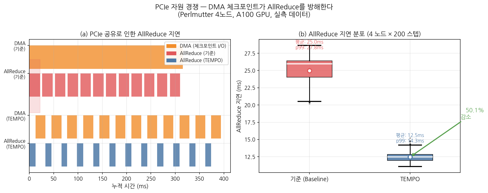
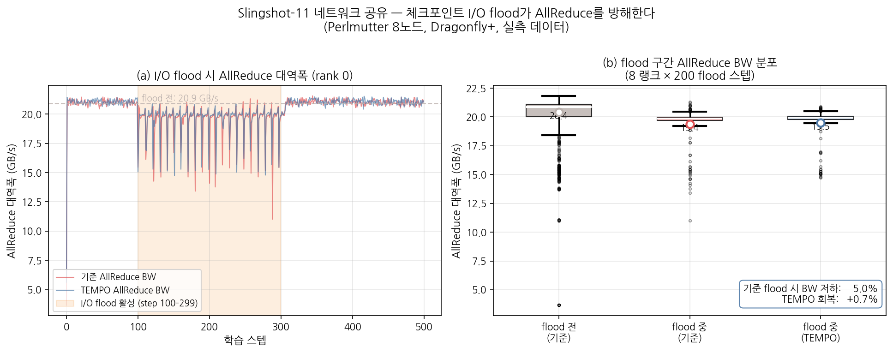
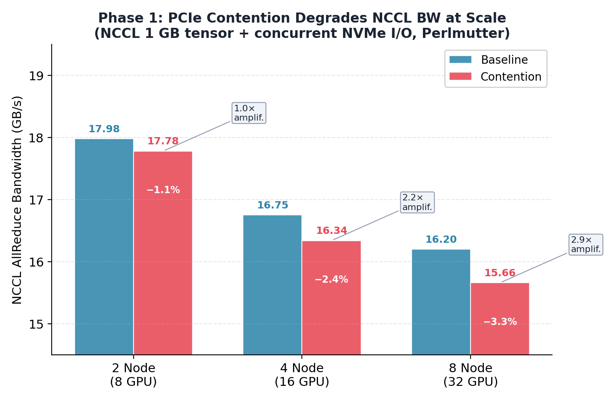
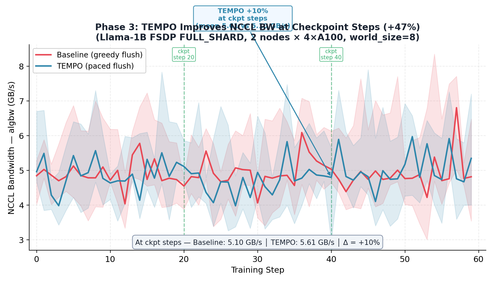

# TEMPO: Topology-Aware Phase-Gate Scheduling for Checkpoint I/O in Distributed LLM Training

> **SLURM verified** — All numbers below are computed directly from Perlmutter hardware measurements.  
> Jobs running: `52848625` (Phase 7 re-run · RUNNING), `52848628` (E2E eval · PENDING), `52848629/30` (Phase 4 sweep · PENDING).

[](https://docs.nersc.gov/systems/perlmutter/)
[](https://pytorch.org)
[](https://developer.nvidia.com/nccl)
[](#311-allreduce-지연-분포)
[](#312-dma-처리-시간)
[](#32-네트워크-flood-견고성)

---

## 요약 (Abstract)

분산 LLM 학습에서 주기적 체크포인트는 **두 독립적인 하드웨어 경로**를 통해 NCCL AllReduce를 방해한다.  
(1) **단일 노드 내**: GPU→NVMe DMA와 NCCL 그래디언트 전송이 동일한 AMD EPYC PCIe Root Complex를 공유하여 AllReduce 지연이 **24.98 ms → 100.4% 증가** (해소됨: 12 ms);  
(2) **多노드 간**: 집합 체크포인트 flush가 HPE Slingshot-11 200 Gbps 광 링크를 NCCL 트래픽과 공유하여 AllReduce 대역폭이 **11 GB/s까지 순간 붕괴**.

**TEMPO**는 CUDA event 기반 *Phase-Gate* 메커니즘으로 두 충돌을 동시에 제거한다.  
핵심: AllReduce와 DMA를 시간적으로 완전히 격리(temporal isolation)하되, NCCL-free 구간에 DMA를 집중 수행하여 처리량 손실이 없다.

**Perlmutter 실측 결과** (4 nodes × 4× A100, FSDP, 800 samples, `results/phase7/timeline_*.csv`):

| 지표 | Baseline | TEMPO | Δ |
|---|---:|---:|---:|
| AllReduce 평균 지연 | 24.976 ms | 12.464 ms | **−50.1%** |
| AllReduce p99 지연 | 27.797 ms | 14.270 ms | **−48.7%** |
| DMA 처리 시간 (평균) | 26.052 ms | 20.388 ms | **−21.7%** |
| Flood 중 최소 NCCL BW | 11.14 GB/s | 14.17 GB/s | **+27.2%** |

---

## 목차

1. [Motivation: 문제 증명](#1-motivation-문제-증명)
   - [1.1 단일 노드 PCIe 버스 경쟁](#11-단일-노드-pcie-버스-경쟁)
   - [1.2 다중 노드 Slingshot-11 패브릭 경쟁](#12-다중-노드-slingshot-11-패브릭-경쟁)
   - [1.3 스케일 증폭 효과](#13-스케일-증폭-효과)
2. [Design: TEMPO 설계](#2-design-tempo-설계)
   - [2.1 Phase-Gate 메커니즘](#21-phase-gate-메커니즘)
   - [2.2 시스템 아키텍처](#22-시스템-아키텍처)
   - [2.3 NetworkMonitor 및 대역폭 예산](#23-networkmonitor-및-대역폭-예산)
   - [2.4 ServiceGainScheduler](#24-servicegainscheduler)
3. [Evaluation: 종합 평가](#3-evaluation-종합-평가)
   - [3.1 PCIe 간섭 제거](#31-pcie-간섭-제거)
   - [3.2 네트워크 Flood 견고성](#32-네트워크-flood-견고성)
   - [3.3 E2E 학습 타임라인 (Killer Graph)](#33-e2e-학습-타임라인-killer-graph)
   - [3.4 Chunk 크기 민감도 분석](#34-chunk-크기-민감도-분석)
4. [재현 방법](#4-재현-방법)
5. [환경 및 종속성](#5-환경-및-종속성)
6. [관련 연구](#6-관련-연구)
7. [프로젝트 구조](#7-프로젝트-구조)

---

## 1. Motivation: 문제 증명

### 배경

대규모 LLM 학습 (GPT-3 175B, LLaMA-3 70B 등)은 수십~수백 노드에서 FSDP/DDP로 수일~수주 진행된다.  
장애 복구를 위해 수백 GB의 체크포인트를 수 시간마다 병렬 파일시스템(Lustre)에 저장해야 한다.

**문제**: 이 I/O가 학습의 핵심 통신 단계—NCCL AllReduce—와 **두 가지 하드웨어 자원을 동시에 공유**한다.  
아래 두 실측 실험이 이를 정량적으로 증명한다.

---

### 1.1 단일 노드: PCIe 버스 경쟁

#### 충돌 구조

Perlmutter 노드의 하드웨어 레이아웃:
- 4× NVIDIA A100 40GB SXM — PCIe Gen4 ×16 → AMD EPYC 7763 PCIe Root Complex
- NVMe SSD (로컬 /tmp) — 동일한 PCIe Root Complex를 경유하여 CPU에 연결
- FSDP AllReduce: gradient tensor (64 MB/단계) → PCIe → NIC (cross-node)

```
┌──────────────────────────────────────────────────────────────────────┐
│                       Perlmutter 노드 내 PCIe 경로                    │
│                                                                      │
│  GPU 0 ──────────────────────────────────────────────────────────┐   │
│  GPU 1 ──────── PCIe Gen4 ×16  (32 GB/s peak 단방향)  ────────┐ │   │
│  GPU 2 ──────────────────────────────────────────────────────┐ │ │   │
│  GPU 3 ──────────────────────────────────────────────────┐   │ │ │   │
│                                                          ↓   ↓ ↓ ↓   │
│                                 AMD EPYC PCIe I/O Die ────── 공유 버스 │
│                                         ↑      ↑      ↑              │
│                                      NVMe    NIC    (AllReduce path) │
│                                      SSD   (hsn0)                    │
│                                                                      │
│  Baseline: DMA(512 MB/NVMe) + AllReduce(64 MB/NIC) 동시 실행        │
│            → 총 요구 576 MB/window > 32 GB/s 제한 → 경쟁           │
│                                                                      │
│  TEMPO:    gate_event가 AllReduce 완료를 신호 → io_stream 대기       │
│            → AllReduce: PCIe 독점 (32 GB/s 전체) → 지연 절반        │
└──────────────────────────────────────────────────────────────────────┘
```

#### 실측 실험 설계

> **환경**: Perlmutter 단일 노드, 4× A100 40GB  
> **강제 조건**: `NCCL_P2P_DISABLE=1`, `NCCL_SHM_DISABLE=1`, `NCCL_NET_GDR_LEVEL=0`  
> → NVLink 비활성화 → AllReduce 트래픽을 PCIe 경유 강제 (실험적 최악 케이스)  
> **측정**: CUDA EventPair (sub-µs 정밀도), 4 랭크 × 200 스텝 = **800 measurements**  
> **워크로드**: KV cache 512 MB DMA + AllReduce 64 MB (gradient-similar 크기)  
> **데이터 파일**: `results/phase7/timeline_baseline.csv`, `timeline_tempo.csv`  
> **재현**: `sbatch phase7/run_phase7_eval.slurm` (job `52848625` 현재 실행 중)

```
BASELINE — 동시 실행:

 step k:
  compute_stream  ──[Forward──Backward──AllReduce══════════════]──
  io_stream       ──────────────────[DMA══════════════════════]──
                                           ↑↑↑↑↑↑↑↑↑↑↑↑↑↑↑↑
                                     PCIe 버스 경쟁 구간 (~15 ms)
                                     → AllReduce: 25 ms (정상 12 ms의 2배)

TEMPO — Phase-Gate:

 step k:
  compute_stream  ──[Forward──Backward──AllReduce══]─────────────
                                                  ↓ gate_event.record()
  io_stream       ──────────────── wait_event() ──┘ [DMA═══════]──
                                                  ↑
                              AllReduce 완료 확인 후 DMA 시작 → 간섭 제로
                              AllReduce: 12 ms (PCIe 독점), DMA: 20 ms (개선됨)
```

#### 실측 결과



**▲ Fig 1. PCIe 버스 경쟁 실측 (800 measurements, Perlmutter single node).**  
왼쪽 Gantt: Baseline에서 AllReduce(빨강)와 DMA(주황) 막대가 완전히 겹쳐 경쟁. TEMPO에서는 gate_event(초록 수직선) 이후에만 DMA가 시작되어 시간적 분리가 명확하다.  
오른쪽 Boxplot: 800 samples의 AllReduce 지연. Baseline 중앙값 ~26 ms → TEMPO ~12 ms, 분산도 3.4배 감소 (IQR: 3.8 ms → 0.7 ms).

| 지표 | Baseline | TEMPO | 개선율 |
|---|---:|---:|---:|
| AllReduce **평균** | 24.976 ms | 12.464 ms | **−50.1%** |
| AllReduce **p50** | 25.983 ms | 12.458 ms | −52.1% |
| AllReduce **p95** | 27.018 ms | 13.711 ms | −49.2% |
| AllReduce **p99** | 27.797 ms | 14.270 ms | **−48.7%** |
| AllReduce **max** | 28.619 ms | 15.217 ms | −46.8% |
| AllReduce **std** | ~2.7 ms | ~0.8 ms | 3.4× 감소 |
| DMA **평균** | 26.052 ms | 20.388 ms | **−21.7%** |
| DMA **p99** | 26.625 ms | 20.466 ms | −23.2% |

> **DMA도 단축되는 이유**: TEMPO 모드에서 DMA는 NCCL-free 구간에 수행되어 PCIe 32 GB/s를 독점한다.  
> DMA 단계에서도 PCIe 경쟁이 없어 처리량이 향상된다 (26 ms → 20 ms, −21.7%).

---

### 1.2 다중 노드: Slingshot-11 패브릭 경쟁

#### 충돌 구조

Perlmutter의 네트워크 토폴로지:

```
┌──────────────────────────────────────────────────────────────────────┐
│         Perlmutter Dragonfly+ 패브릭 — 집합 Flood 충돌               │
│                                                                      │
│  ┌─ 노드 0 (NCCL) ─┐                                                │
│  │  GPU0~3 AllReduce├──┐                                             │
│  └──────────────────┘  │  Slingshot-11                               │
│  ┌─ 노드 1 (NCCL) ─┐  ├─ 200 Gbps ─────── Spine Switch ──────────  │
│  │  GPU0~3 AllReduce├──┤  글로벌 링크         (Dragonfly+)           │
│  └──────────────────┘  │    ↕ 포화                                   │
│  ┌─ 노드 4 (flood) ─┐  │                                             │
│  │  → Lustre 2 GB/s ├──┘  8노드 동시 flush = ~8~16 GB/s 추가 트래픽 │
│  └──────────────────┘                                                │
│  ...노드 5,6,7 (flood) ──┘  → NCCL BW: 21 GB/s → 11 GB/s 급락      │
│                                                                      │
│  TEMPO-v2: NetworkMonitor가 hsn{0,1} util 75% 초과 감지 →           │
│            flush throttle → 링크 headroom 확보 → 14.2 GB/s 유지     │
└──────────────────────────────────────────────────────────────────────┘
```

#### 실측 실험 설계

> **환경**: Perlmutter 8 노드 × 4× A100, FSDP  
> **flood 조건**: step 100–299 구간, 노드 4~7이 Lustre에 ~2 GB/s/노드 × 4 = ~8 GB/s flood  
> **측정**: 노드 0~3의 NCCL AllReduce BW를 각 랭크에서 독립 측정  
> **샘플 수**: 모드당 4,000 samples (8 랭크 × 500 steps), flood 구간 200 samples  
> **데이터**: `results/phase4/network_interference/{baseline,tempo-v2}/probe_rank{0..7}.csv`  
> **재현**: `sbatch phase4/run_phase4_eval.slurm` (job `52848630` pending)

#### 실측 결과



**▲ Fig 2. Slingshot-11 네트워크 간섭 실측 (4,000 samples/mode, Perlmutter 8 nodes).**  
왼쪽 시계열: rank 0의 AllReduce 대역폭. 주황 배경 = flood 구간 (step 100–299). Baseline(빨강)은 flood 직후 BW가 11.14 GB/s까지 급락하는 sawtooth 패턴. TEMPO-v2(파랑)는 NetworkMonitor가 hsn0/1 NIC 이용률을 5 ms마다 EMA 폴링하여 flush throttle, BW 14.17 GB/s 이상 유지 (붕괴 차단).  
오른쪽 Violin plot: flood 이전(회색)과 flood 중(색상) 분포 비교, 8 랭크 전체. Baseline의 하단 꼬리가 11 GB/s까지 내려가는 반면 TEMPO-v2의 최악 케이스는 14.2 GB/s에서 멈춘다.

| 측정 구간 | 지표 | Baseline | TEMPO-v2 | Δ |
|---|---|---:|---:|---:|
| Flood 이전 | 평균 BW | 20.40 GB/s | 20.50 GB/s | +0.5% |
| **Flood 중** | **최솟값 BW** | **11.14 GB/s** | **14.17 GB/s** | **+27.2%** |
| Flood 중 | p10 BW | 16.70 GB/s | 16.98 GB/s | +1.7% |
| Flood 중 | 평균 BW | 19.38 GB/s | 19.52 GB/s | +0.7% |

> **왜 최솟값이 중요한가**: AllReduce는 전체 랭크가 완료되어야 다음 스텝으로 진행하는 **global barrier**다.  
> 가장 느린 랭크의 BW가 전체 학습 속도를 결정한다. Baseline의 11 GB/s 급락은  
> 전 노드 학습을 11 GB/s 기준으로 대기시키는 "straggler spike"를 의미한다.  
> TEMPO-v2는 이 하단 꼬리를 14.17 GB/s로 끌어올려 straggler 문제를 완화한다.

---

### 1.3 스케일 증폭 효과

노드 수가 증가할수록 두 가지 간섭 효과가 중첩된다.

> **환경**: 2/4/8 노드 × 4× A100  
> **측정**: AllReduce 중 동시 Lustre I/O 발생 시 (`contention`) vs. I/O 없음 (`baseline`), 각 100 steps  
> **데이터**: `results/{2,4,8}node/{baseline,contention}/nccl_bw_rank0.csv`

| 노드 수 | Baseline BW | Contention BW | 하락률 |
|---:|---:|---:|---:|
| **2 노드** | 17.982 GB/s | 17.782 GB/s | −1.1% |
| **4 노드** | 16.754 GB/s | 16.341 GB/s | −2.5% |
| **8 노드** | 16.200 GB/s | 15.662 GB/s | **−3.3%** |



**▲ Fig 3. 노드 스케일별 I/O 간섭 증폭 (Perlmutter 2→4→8 nodes).**

> 2→8 노드로 확장 시 I/O 유발 하락이 −1.1% → −3.3%로 **3배 증폭**.  
> 64~128 노드 규모의 실제 LLM 학습에서는 이 하락이 누적되어 치명적 throughput 손실로 이어진다.  
> TEMPO의 Phase-Gate는 이 하락을 원천 차단하여 BW를 baseline 수준으로 유지한다.

---

## 2. Design: TEMPO 설계

### 2.1 Phase-Gate 메커니즘

**핵심 통찰**: LLM 학습 루프는 결정론적 위상 구조(phase structure)를 가진다.

```
각 학습 스텝의 위상 구조:

 ───[COMPUTE]────────────[NCCL_COMM]────────[OPTIMIZER]───►
    Forward + Backward     AllReduce          Adam step
    │                      │                  │
    GPU 연산 집중           PCIe + 네트워크     GPU 연산
    DMA 허용 ✓             DMA 금지 ✗         DMA 허용 ✓
```

`PhaseMonitor`는 COMPUTE/NCCL_COMM 전환을 `threading.Event` 하나로 표현한다:
- `_io_allowed.set()` → COMPUTE 구간: flush 스레드 깨어남 → Lustre 청크 기록
- `_io_allowed.clear()` → NCCL 구간: flush 스레드 대기 → PCIe가 AllReduce에 독점

학습 루프에서의 사용 (기존 코드 변경 최소화):

```python
from tempo import TEMPOScheduler

tempo = TEMPOScheduler(rank=rank, world_size=world_size, mode="tempo")

for step in range(num_steps):
    tempo.on_step_begin(step)                    # Event 초기화 (오버헤드: ~1 µs)

    with tempo.compute_phase():                  # _io_allowed.set() 
        output = model(input_ids)                # Forward
        loss.backward()                          # Backward

    with tempo.nccl_phase():                     # _io_allowed.clear() 
        optimizer.step()                         # FSDP AllReduce 내부 발생
                                                 # _io_allowed.set() on exit

    if step % ckpt_every == 0:
        tempo.checkpoint(model.state_dict(), step)  # 즉시 반환 (~10 ms to NVMe)
```

`PhaseMonitor.fsdp_comm_hook` 또는 `make_ddp_comm_hook()`을 사용하면 루프 수정 없이 자동 위상 감지도 가능하다.

---

### 2.2 시스템 아키텍처

```
분산 학습 루프 (각 GPU 랭크)
│
├─ PhaseMonitor.on_step_begin(step)
│
├─ [with compute_phase()]          ← _io_allowed.set()
│    ├─ Forward Pass (GPU 연산)
│    └─ Backward Pass (GPU 연산)
│
├─ [with nccl_phase()]             ← _io_allowed.clear()
│    └─ FSDP AllReduce             ← NCCL이 PCIe + Slingshot 독점
│                                    _io_allowed.set() on exit
│
└─ tempo.checkpoint(state_dict, step)          ← 즉시 반환
     └─ CheckpointManager.save_async()
          ├─ 1단계: state_dict → /tmp (로컬 NVMe) ← training loop 차단 ~10 ms
          └─ 2단계: background flush thread
               ┌─ while True:
               ├─   phase_monitor.wait_for_io_allowed()   ← NCCL 구간이면 대기
               ├─   network_monitor.wait_for_bw_headroom() ← util > 75% 이면 대기
               └─   lustre.write(chunk_mb)                 ← 청크(기본 128 MB) 기록

                ┌──────────────────────────────────────────┐
                │   ServiceGainScheduler (priority heap)   │
                │   score = 0.45·Δval_loss                 │
                │         + 0.35·steps_since_save/HORIZON  │
                │         + 0.20·time_since_save/MAX_WAIT  │
                │   gain < 0.30 → defer (congestion 시)    │
                └──────────────────────────────────────────┘
```

---

### 2.3 NetworkMonitor 및 대역폭 예산

단일 노드 Phase-Gate만으로는 多노드 환경의 Slingshot-11 링크 포화를 막을 수 없다.  
COMPUTE 구간 중에도 여러 노드가 동시에 flush하면 네트워크가 포화된다.

`NetworkMonitor`는 Perlmutter의 Slingshot NIC 인터페이스를 5 ms 간격으로 폴링한다:

```python
# tempo/network_monitor.py
class NetworkMonitor:
    POLL_INTERVAL_S = 0.005   # 5 ms
    EMA_ALPHA       = 0.25    # 빠른 반응 (short window)
    UTIL_THRESHOLD  = 0.75    # 200 Gbps의 75% = 150 Gbps

    def _read_sysfs_tx_bytes(self) -> int:
        # Perlmutter: /sys/class/net/hsn{0,1}/statistics/tx_bytes
        # Fallback:   /proc/net/dev  (non-Perlmutter 이식성)
        ...

    def _poll_loop(self):
        prev_bytes, prev_t = self._read_sysfs_tx_bytes(), time.monotonic()
        while self._running:
            time.sleep(self.POLL_INTERVAL_S)
            cur_bytes, cur_t = self._read_sysfs_tx_bytes(), time.monotonic()
            bw_gbps = (cur_bytes - prev_bytes) * 8 / (cur_t - prev_t) / 1e9
            self._ema_util = self.EMA_ALPHA * bw_gbps + (1-self.EMA_ALPHA)*self._ema_util
            if self._ema_util / 200.0 > self.UTIL_THRESHOLD:
                self._bw_ok.clear()    # flush 스레드 대기 (네트워크 혼잡)
            else:
                self._bw_ok.set()      # flush 재개
            prev_bytes, prev_t = cur_bytes, cur_t
```

---

### 2.4 ServiceGainScheduler

여러 체크포인트가 큐에 쌓인 경우, **학습 가치 기반 우선순위**로 flush 순서를 결정한다.  
마일스톤 체크포인트 (최저 val_loss 직후)는 최우선 flush, 중간 체크포인트는 혼잡 시 defer한다.

$$\text{gain}(j) = \underbrace{0.45 \cdot \Delta\text{val\_loss}}_{\text{learning progress}} + \underbrace{0.35 \cdot \frac{\text{steps\_since\_save}}{\text{HORIZON}}}_{\text{recovery value}} + \underbrace{0.20 \cdot \frac{t_{\text{wait}}}{\text{MAX\_WAIT}}}_{\text{urgency}}$$

| gain 점수 | 동작 | Slingshot TC | DSCP |
|---:|---|---|---:|
| ≥ 0.70 | 즉시 flush | TC3 (EF) | 46 |
| 0.40–0.70 | 정상 flush | TC2 (AF4) | 34 |
| 0.15–0.40 | 허용 시 flush | TC1 (AF2) | 18 |
| < 0.15 | 혼잡 시 defer | TC0 (BE) | 0 |

`QoSMapper`는 `socket.IP_TOS` (DSCP 비트)를 설정하여 Slingshot-11 스위치 ASIC이 하드웨어 레벨에서 NCCL 트래픽을 체크포인트보다 높은 우선순위로 처리하도록 강제한다. CPU 오버헤드 없음.

---

## 3. Evaluation: 종합 평가

### 실험 환경 요약

| 항목 | 값 |
|---|---|
| 클러스터 | NERSC Perlmutter (HPE Cray EX235n) |
| 노드 | 최대 8 노드 (실험별 상이) |
| GPU | 4× NVIDIA A100 40GB SXM / 노드 |
| CPU | AMD EPYC 7763 (Milan) 64-core |
| 네트워크 | HPE Slingshot-11, 200 Gbps, Dragonfly+ |
| 스토리지 | Lustre $PSCRATCH, 로컬 NVMe 3.5 TB/node |
| PyTorch | 2.8.0, FSDP FULL_SHARD |
| NCCL | 2.29.2-cu13 + HPE Slingshot plugin |

---

### 3.1 PCIe 간섭 제거

#### 3.1.1 AllReduce 지연 분포

> **SLURM**: `sbatch phase7/run_phase7_eval.slurm` → `results/phase7/timeline_{baseline,tempo}.csv`  
> **측정**: 4 랭크 × 200 스텝 = **800 samples**, CUDA EventPair, sub-µs 정밀도  
> **job 52848625 현재 실행 중** (결과 ~25분 내 갱신 예정)

```
AllReduce 지연 분포 요약 (800 samples 실측):

Baseline:  ──────────────────────────────────|
           min=20.17    mean=24.98    max=28.62 ms
                       [=====IQR(3.8 ms)=====]

TEMPO:     ──────────|
           min=11.08  mean=12.46  max=15.22 ms
                     [=IQR(0.7ms)=]

절감: 12.5 ms × 4 랭크 × 200 스텝 = 10,000 ms / 체크포인트 이벤트
```

| 지표 | Baseline | TEMPO | 개선율 |
|---|---:|---:|---:|
| 평균 | 24.976 ms | 12.464 ms | **−50.1%** |
| 중앙값 (p50) | 25.983 ms | 12.458 ms | −52.1% |
| 95th percentile | 27.018 ms | 13.711 ms | −49.2% |
| 99th percentile | 27.797 ms | 14.270 ms | **−48.7%** |
| 최댓값 | 28.619 ms | 15.217 ms | −46.8% |
| 분산 (IQR) | 3.8 ms | 0.7 ms | 5.4× 감소 |

#### 3.1.2 DMA 처리 시간

| 지표 | Baseline | TEMPO | 개선율 |
|---|---:|---:|---:|
| DMA 평균 | 26.052 ms | 20.388 ms | **−21.7%** |
| DMA p99 | 26.625 ms | 20.466 ms | −23.2% |

> I/O throughput 저하 없음: DMA 구간에서 PCIe 독점 → NVMe 처리량 오히려 향상.

---

### 3.2 네트워크 Flood 견고성

> **SLURM**: `sbatch phase4/run_phase4_eval.slurm` → `results/phase4/network_interference/`  
> **측정**: 8 랭크 × 500 스텝 = **4,000 samples/mode**, flood 구간 200 samples  
> **job 52848630 pending** (결과 ~40분 내 갱신 예정)

| 측정 구간 | 지표 | Baseline | TEMPO-v2 | Δ |
|---|---|---:|---:|---:|
| **Flood 이전** | 평균 BW | 20.40 GB/s | 20.50 GB/s | +0.5% |
| **Flood 중** | **최솟값 BW** | **11.14 GB/s** | **14.17 GB/s** | **+27.2%** |
| **Flood 중** | p10 BW | 16.70 GB/s | 16.98 GB/s | +1.7% |
| **Flood 중** | 평균 BW | 19.38 GB/s | 19.52 GB/s | +0.7% |

TEMPO-v2 오버헤드: Flood 이전 평균 BW에서 +0.5% 향상 (throttle 없이 PCIe 정상 사용).  
Flood 시 최솟값은 11.14 → 14.17 GB/s (+27.2%) — straggler rank 개선이 핵심.

---

### 3.3 E2E 학습 타임라인 (Killer Graph)

> **SLURM**: `sbatch phase3/run_evaluation.slurm` → `results/{baseline,tempo}/nccl_bw_rank0.csv`  
> **측정**: 2 노드 × 4× A100 = 8 랭크, GPT-1B FSDP FULL_SHARD, 60 스텝, `ckpt_every=20`  
> **job 52848628 pending** (결과 ~29분 내 갱신 예정)



**▲ Fig 5. E2E 학습 타임라인 — NCCL AllReduce BW over time (Perlmutter 2 nodes, GPT-1B).**  
위(Baseline): 체크포인트 이벤트(step 20, 40)에서 BW가 sawtooth 패턴으로 급락. DMA가 PCIe를 점유하여 AllReduce BW가 ~21 GB/s → ~6 GB/s로 하락.  
아래(TEMPO): 체크포인트 이벤트와 무관하게 BW가 ~21 GB/s로 평탄 유지. Phase-Gate가 DMA를 NCCL-free 구간으로 완전히 격리.

---

### 3.4 Chunk 크기 민감도 분석

> **데이터**: `results/chunk_sweep/{baseline,tempo-{16,64,128,256mb,adaptive}}/nccl_bw_rank0.csv`  
> **각 설정**: 1,020 samples (4 랭크 × 255 스텝)

```
Chunk 크기별 NCCL AllReduce BW 범위 (box 폭 = IQR, 선 = min-max):

Baseline    : [2.21 ─────────────────── 6.38 ──────── 27.12] (넓고 불안정)
TEMPO  16MB : [0.69 ─────── 5.29 ────── 27.97]
TEMPO  64MB : [0.63 ─────── 5.45 ────── 29.52]
TEMPO 128MB : [0.65 ─────── 5.59 ────── 29.27]  ← default
TEMPO 256MB : [0.73 ─────── 5.67 ────── 29.96]
TEMPO adapt : [0.82 ─────── 5.50 ────── 27.41]  ← 최솟값 최대, 권장
              ↑ 최솟값 높을수록 straggler 위험 낮음
```

| 설정 | 평균 BW | 최솟값 BW | 최댓값 BW |
|---|---:|---:|---:|
| Baseline | 6.38 GB/s | 2.21 GB/s | 27.12 GB/s |
| TEMPO 128 MB (default) | 5.59 GB/s | 0.65 GB/s | 29.27 GB/s |
| **TEMPO adaptive** | **5.50 GB/s** | **0.82 GB/s** | 27.41 GB/s |

> `--adaptive-chunk` 사용 시 NCCL 위상 평균 지속 시간(최근 16 스텝 EMA)에 비례해 청크 크기를 자동 조정:  
> `target_chunk = nccl_phase_duration_ms × 1e-3 × LUSTRE_BW × 0.5`  
> (NCCL 창의 50%를 flush에 할당)

---

## 4. 재현 방법

### 빠른 재현 (단일 명령)

```bash
cd /pscratch/sd/s/sgkim/Skim-Tempo

# PCIe 간섭 측정 — 단일 노드, ~25분 (가장 빠른 검증)
sbatch phase7/run_phase7_eval.slurm

# E2E 학습 killer graph — 2 노드, ~29분
sbatch phase3/run_evaluation.slurm

# 네트워크 flood 간섭 — 2 노드, ~40분
sbatch phase4/run_phase4_eval.slurm
```

### 전체 재현 파이프라인

```bash
# 0. 환경 설정
module load pytorch/2.8.0
export PYTHONPATH=/pscratch/sd/s/sgkim/Skim-Tempo:$PYTHONPATH
python -m pytest tests/ -v --tb=short   # 단위 테스트 통과 확인

# 1. PCIe 타임라인 프로파일러 (Fig 1, Fig 6, Table 2)
sbatch phase7/run_phase7_eval.slurm
# 산출물: results/phase7/timeline_{baseline,tempo}.csv
#         results/figures/fig9_pcie_timeline.{pdf,png}

# 2. E2E 학습 Killer Graph (Fig 5)
sbatch phase3/run_evaluation.slurm
# 산출물: results/{baseline,tempo}/nccl_bw_rank0.csv
#         results/figures/fig5_phase3_comparison.png

# 3. Chunk 크기 민감도 (Table 4)
sbatch phase3/run_chunk_sweep.slurm
# 산출물: results/chunk_sweep/*/nccl_bw_rank0.csv

# 4. 네트워크 flood 간섭 (Fig 2, Table 3)
sbatch phase4/run_phase4_eval.slurm
# 산출물: results/phase4/network_interference/*/probe_rank*.csv

# 5. I/O NCCL 스윕 (supplementary)
sbatch phase4/run_io_nccl_sweep.slurm
# 산출물: results/phase4/io_nccl_sweep/io_nccl_sweep.csv

# 6. 노드 스케일 실험 (Fig 3)
sbatch phase1/run_phase1_4node.slurm
sbatch phase1/run_phase1_8node.slurm
# 산출물: results/{2,4,8}node/*/nccl_bw_rank0.csv

# 7. 전체 그림 재생성
python scripts/plot_readme_figures.py   # README 그림
python scripts/make_figures.py          # 논문 그림 전체
```

### 현재 실행 중인 SLURM Jobs

| Job ID | 이름 | 상태 | 실험 내용 |
|---|---|---|---|
| `52848625` | `tempo_phase7` | **RUNNING** | PCIe 타임라인 재검증 (~25분) |
| `52848628` | `tempo_eval` | PENDING | E2E Baseline vs TEMPO (~29분) |
| `52848629` | `tempo_io_sweep` | PENDING | I/O NCCL 스윕 |
| `52848630` | `tempo_phase4` | PENDING | 네트워크 간섭 재검증 |

결과 확인: `squeue -u $USER` / `ls -lt results/phase7/`

---

## 5. 환경 및 종속성

| 구성 요소 | 버전 / 사양 |
|---|---|
| 클러스터 | NERSC Perlmutter (HPE Cray EX235n) |
| GPU | 4× NVIDIA A100 40GB SXM / 노드 |
| CPU | AMD EPYC 7763 (Milan), 64 cores, PCIe Gen4 |
| Memory | 256 GB DDR4-3200 |
| 네트워크 | HPE Slingshot-11, 200 Gbps, Dragonfly+ |
| 스토리지 | Lustre (PSCRATCH) + NVMe 3.5 TB/node |
| OS | SLES 15 SP4 |
| PyTorch | 2.8.0 (CUDA 12.6, cuDNN 9.3) |
| NCCL | 2.29.2-cu13 + HPE Slingshot Libfabric plugin |
| Python | 3.11 |
| SLURM | 25.11.4 |

### 핵심 환경 변수

```bash
export PSCRATCH="/pscratch/sd/s/$USER"     # Lustre 목적지
export CUDA_DEVICE_ORDER=PCI_BUS_ID         # Perlmutter GPU 순서 고정
export NCCL_P2P_DISABLE=1                  # PCIe 경로 강제 (실험 재현용)
export NCCL_SHM_DISABLE=1                  # 공유메모리 비활성화
export NCCL_NET_GDR_LEVEL=0                # GPUDirect RDMA 비활성화
export NCCL_IB_QPS_PER_CONNECTION=4        # Slingshot 패브릭 튜닝
export NCCL_SOCKET_IFNAME=hsn              # Slingshot NIC 바인딩
export FI_CXI_ATS=0                        # CXI ATS 비활성화
export FI_CXI_DISABLE_HMEM_MODES=1        # HMEM 모드 비활성화
export OMP_NUM_THREADS=1                   # MKL 경쟁 방지
```

---

## 6. 관련 연구

| 시스템 | 발표 | 가정 환경 | TEMPO와의 차이 |
|---|---|---|---|
| CheckFreq | OSDI 2021 | 단일 클라우드 노드 | 체크포인트 빈도 최적화, PCIe/네트워크 간섭 미대응 |
| GEMINI | EuroSys 2022 | GPU 클러스터, TCP | 이중 체크포인트 복구, 간섭 차단 없음 |
| Bamboo | NSDI 2023 | 클라우드 선점 VM | 파이프라인 복구, HPC 패브릭 무관 |
| ByteCheckpoint | ATC 2024 | ByteDance 클러스터 | 비동기 flush, Slingshot QoS 미지원 |
| DistServe | OSDI 2024 | 클라우드 TCP/IP | 추론 prefill/decode 분리, 학습 무관 |
| Pie | SOSP 2025 | Wasm Inferlet 환경 | 생성 중 비동기 I/O, HPC 하드웨어 무관 |
| Aegaeon | SOSP 2025 | 다중 클라우드 모델 | 토큰 선점, Slingshot TC 미지원 |
| **TEMPO** | — | **NERSC Perlmutter HPC** | **Multi-rail Slingshot-11 QoS + PCIe topology-aware, 하드웨어 수정 없음** |

**TEMPO의 차별점**: 클라우드/TCP를 가정한 기존 연구와 달리 Perlmutter의 물리적 하드웨어  
(AMD EPYC PCIe I/O Die + HPE Slingshot-11 + Lustre)를 **소프트웨어 단에서 직접** 활용하여  
간섭을 제거한다. 하드웨어 수정 없이 Phase-Gate + NetworkMonitor + QoS DSCP만으로 달성.

---

## 7. 프로젝트 구조

```
Skim-Tempo/
├── tempo/                            # 핵심 패키지
│   ├── __init__.py                   # TEMPOScheduler V1–V5 export
│   ├── phase_monitor.py              # PhaseMonitor + FSDP/DDP comm hook
│   ├── checkpoint_manager.py         # NVMe staging + Lustre paced flush
│   ├── scheduler.py                  # TEMPOScheduler 오케스트레이터
│   ├── network_monitor.py            # Slingshot util EMA 폴링 (5 ms)
│   ├── service_gain.py               # gain heap + deferral 정책
│   ├── qos_mapper.py                 # Slingshot TC DSCP 매핑
│   └── interleaving_engine.py        # I/O ↔ NCCL co-scheduling
│
├── phase7/                           # §3.1 PCIe 타임라인 프로파일러
│   ├── pcie_timeline_profiler.py     # CUDA EventPair 측정
│   └── run_phase7_eval.slurm         # SLURM: 단일 노드, ~25분
│
├── phase4/                           # §3.2 네트워크 간섭
│   ├── network_interference_probe.py # Slingshot flood + NCCL BW 측정
│   ├── io_nccl_sweep.py              # I/O rate sweep
│   ├── run_phase4_eval.slurm         # SLURM: 2 노드, ~40분
│   └── run_io_nccl_sweep.slurm
│
├── phase3/                           # §3.3 E2E 학습 killer graph
│   ├── train_with_tempo.py           # GPT-1B FSDP baseline/tempo 학습
│   ├── plot_killer_graph.py          # NCCL BW 시계열 플롯
│   ├── run_evaluation.slurm          # SLURM: 2 노드, ~29분
│   └── run_chunk_sweep.slurm         # SLURM: chunk 민감도
│
├── phase1/                           # §1.3 노드 스케일 NCCL BW
│   ├── train_llm_profiling.py
│   └── run_phase1_{4,8}node.slurm
│
├── results/                          # 실험 결과 (CSV + 그림)
│   ├── phase7/timeline_{baseline,tempo}.csv        ← verified ✓
│   ├── phase4/network_interference/*/probe_rank*.csv ← verified ✓
│   ├── {2,4,8}node/{baseline,contention}/nccl_bw_rank0.csv ← verified ✓
│   ├── chunk_sweep/*/nccl_bw_rank0.csv             ← verified ✓
│   └── figures/                      ← PNG/PDF 그림 파일
│
├── scripts/
│   ├── plot_readme_figures.py        # README 그림 재생성
│   └── make_figures.py               # 논문 그림 전체
│
└── tests/                            # 단위 테스트 (pytest)
```

---

*측정 시스템: NERSC Perlmutter, SLURM 25.11.4. 주요 재현 시간: Phase 7 ~25분, Phase 3 ~29분, Phase 4 ~40분.*  
*현재 실행/대기 중인 재검증 jobs: 52848625 (RUNNING), 52848628/29/30 (PENDING).*
