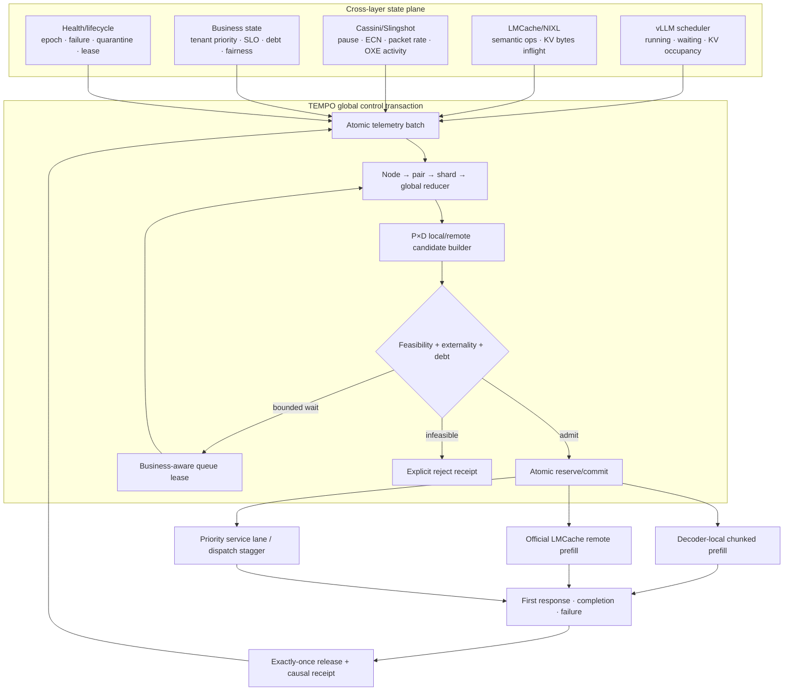

# TEMPO-GO

## Shared HPC Fabric에서의 Disaggregated LLM Inference를 위한 Cross-Layer Global Orchestration

TEMPO-GO는 local/remote 중 하나를 고르는 단순 router가 아니다. 실제 vLLM
Prefill/Decode(P/D), LMCache KV 이동, decoder scheduler, Cassini/Slingshot 상태,
tenant priority와 fairness, P×D mesh capacity를 하나의 admission·dispatch·release
transaction으로 제어하는 Perlmutter 지향 global orchestrator다.

**현재 상태:** C9 fresh 4-node independent validation 완료 · C10 NetKV/Kairos
paper-policy comparison 완료 · 7-page paper와 SHA-bound artifact 공개

[논문 PDF](paper/tempo_go/main.pdf) ·
[논문 소스](paper/tempo_go/main.tex) ·
[Artifact manifest](paper/tempo_go/artifact_manifest.json) ·
[전체 연구 상태·실행계획](paper/TEMPO_GO_UNIFIED_GOAL_STATE_AND_EXECUTION_PLAN.ko.md)

> [!IMPORTANT]
> Headline claim은 **C9 fresh-allocation independent four-node result**다.
> C10은 actual vLLM/LMCache carrier에서 측정했지만 같은 allocation 안에서 완성된
> **post-hoc extension**이다. Kairos 결과는 stock vLLM에서 가능한
> **`X={512}` subset reproduction**이며 full Kairos 구현이라고 주장하지 않는다.
> 1,024-pair 결과는 **CPU control-plane scale receipt**이며 1,024-pair native GPU
> inference 성능이 아니다.

---

## 초록

Disaggregated LLM serving은 prefill과 decode의 간섭을 분리하지만, 병목을 없애는
것은 아니다. 실제 HPC 환경에서는 decoder compute, local prefill, remote KV 이동,
LMCache inflight, receiver queue, cache ownership, Slingshot congestion과 tenant SLO가
동시에 변한다. 따라서 항상 local, 항상 remote, queue-only, request-level predictor,
network-only selector 같은 부분 정책은 한 상태에서 맞더라도 병목이 이동하면
completion과 tail latency를 함께 잃을 수 있다.

TEMPO-GO는 각 요청에 대해 모든 local/remote P×D 후보를 구성하고, atomic
cross-layer telemetry batch와 controller-owned reservation을 바탕으로 후보의
feasibility와 externality를 평가한다. 선택은 business admission, decoder service
lane, source/edge virtual service, bounded hierarchy와 하나의 lifecycle로 결합된다.
실행이 시작된 뒤에는 경로를 바꾸지 않으며, first response·completion·failure·timeout
각 경계에서 정확히 한 번 lease를 반환한다.

Qwen2.5-7B-Instruct, vLLM 0.26.0, TP4×4 engine, official
LMCacheConnectorV1/NIXL-UCX/CXI를 사용한 Perlmutter 4-node/16-A100 fresh held-out
실험에서 TEMPO는 normal 60/60, miss-hot 120/120, remote-favorable 30/30의
foreground SLO를 만족했다. stressed p99은 strongest fixed 대비 66.12–90.55%,
predictor 대비 61.69–93.36%, queue-only 대비 58.48–93.54% 감소했다. 실제
NetKV reproduction 대비 miss-hot/remote-favorable p99은 75.79%/93.77% 낮았고,
background completion 85.755%와 Jain fairness 0.99787을 유지했다.

---

## 1. 한눈에 보는 결론

| 구분 | 상태 | 핵심 결과 | 허용되는 주장 |
|---|---|---|---|
| C9 independent validation | **통과** | 210/210 foreground SLO, stressed p99 약 3.3초 | fresh 4-node whole-system win |
| strongest fixed 비교 | **통과** | p99 66.12%/90.55% 감소 | matched miss-hot/remote-favorable |
| predictor 비교 | **통과** | p99 61.69%/93.36% 감소 | 동일 offered population |
| queue-GPU 비교 | **통과** | p99 58.48%/93.54% 감소 | 동일 workload와 block order |
| background/fairness | **통과** | completion 85.755%, Jain 0.99787 | foreground만 살린 결과가 아님 |
| actual NetKV reproduction | **positive** | stressed p99 75.79%/93.77% 감소 | C10 post-hoc actual-carrier comparison |
| Kairos `X={512}` | **positive subset** | normal/remote p99 2.28%/30.82% 감소, completion 우위 | full Kairos가 아닌 restricted subset |
| 1,024 logical pairs | **bounded payload** | 666,815 B → 83,358 B, 87.499% 감소 | CPU control-plane only |

핵심 메시지는 “remote가 항상 나쁘다”도 “LMCache가 문제를 만들지 못한다”도 아니다.
실제 문제는 **어떤 병목이 현재 지배적인지 계속 바뀌는데 부분 정책은 그 이동을 함께
보지 못한다는 것**이다. TEMPO의 성능 차이는 작은 threshold tuning이 아니라
admission, cache semantics, source/receiver service, fabric state와 business objective를
하나의 global decision으로 묶은 데서 나온다.

---

## 2. 왜 이전 README의 negative conclusion이 현재 결론과 달랐는가

이전 루트 README는 2026-08-21 C4 route-only 연구에서 멈춰 있었다. 그 결과 자체는
유효하다. C4는 같은 decoder로 합류하는 두 경로 중 local/remote를 request 단위로
선택했으며, route 선택 정확도는 높았지만 shared decoder admission과 tenant fairness,
P×D mesh source balance를 제어하지 못했다. 따라서 median 이득과 TPOT/worst-tail
isolation을 동시에 달성하지 못했다.

TEMPO-GO는 그 negative result를 삭제하거나 뒤집지 않았다. 실패 원인을 연구 문제로
승격했다.

| 단계 | 질문 | 확인된 사실 | 다음 단계에 반영된 변화 |
|---|---|---|---|
| C1–C3 | local과 remote 중 어느 쪽이 빠른가 | decoder-hot에서는 remote, remote-path-hot에서는 local | 양쪽 path 모두 필요 |
| C4 | request-level predictor와 dual credit이면 충분한가 | 경로 선택은 맞아도 shared decoder tail은 보호 못함 | decoder admission 필요 |
| C5–C6 | fabric/LMCache/NCCL 관측을 붙이면 충분한가 | telemetry만 보고 action이 없으면 utility 개선 없음 | joint actuation과 lease 필요 |
| C7–C8 | business lane과 mesh source balance가 필요한가 | foreground·background·remote activation을 함께 닫을 수 있음 | global transaction 완성 |
| C9 | fresh held-out에서 재현되는가 | 7-arm one-shot independent gate 통과 | headline claim 허용 |
| C10 | paper-derived partial policy보다 강한가 | NetKV/Kairos subset 대비 service dominance | fresh unchanged repeat가 다음 gate |

즉 과거 C4의 결론은 “TEMPO가 가치 없다”가 아니라 **route-only로 TEMPO를 축소하면
안 된다**는 motivation이다.

---

## 3. 연구 동기: bottleneck은 하나가 아니라 이동한다

### 3.1 local과 remote는 모두 overload될 수 있다

- local path는 KV transfer를 피하지만 decoder-local prefill이 decode와 GPU를 공유한다.
- remote path는 prefill compute를 분리하지만 KV bytes, source service, receiver queue와
  LMCache/CXI path를 소비한다.
- cache hit는 binary label이 아니다. `MISS`, `P_ONLY`, `D_ONLY`, `BOTH`, exact
  source ownership에 따라 가능한 후보와 transfer cost가 달라진다.
- decoder가 가득 차면 빠른 network도 요청을 살리지 못한다.
- receiver가 여유로워도 source·edge·LMCache inflight가 포화되면 remote tail이
  폭증한다.
- foreground만 보호하고 background를 사실상 제거하면 business objective를 달성한
  것이 아니다.

이 결합 때문에 “interconnect가 항상 headline bottleneck이어야 한다”는 가정도
부정확하다. 실제 global controller의 역할은 network를 무조건 쓰거나 피하는 것이
아니라, **decoder·source·fabric·cache·business 병목이 이동할 때 전체 utility가
붕괴하지 않도록 action을 함께 바꾸는 것**이다.

### 3.2 기존 partial policy가 놓치는 축

| 정책 계열 | 보는 것 | 놓치는 대표 상태 |
|---|---|---|
| strongest fixed | 한 edge의 평균 강점 | phase change, 다른 decoder/source의 spare capacity |
| request predictor | 예상 local/remote latency | global reservations, tenant debt, simultaneous arrivals |
| queue-GPU | decoder running/waiting | KV ownership, fabric/self-contention, source fairness |
| NetKV-style network-aware selection | KV transfer + decoder free slot | business reserve, pair scaling, lifecycle debt, joint admission |
| Kairos-style prefill deflection | decoder TBT와 chunk schedule | fabric/cache/source global state, tenant fairness |
| transport-only multipath | packet/path utilization | 어떤 LLM request를 어느 P/D pair에 admit할지 |

각 컴포넌트를 누군가 조금씩 다뤘다는 사실은 global orchestration의 가치를 없애지
않는다. 실제 Perlmutter-scale system에서는 이 신호와 actuator를 **같은 request
lifecycle과 같은 objective 아래 묶어 구현하고 검증하는 것**이 핵심이다.

### 3.3 연구 가설

요청 `r`의 후보 `e=(p,d,ρ)`는 prefill source `p`, decoder `d`, route
`ρ∈{local,remote}`를 나타낸다. TEMPO는 다음 개념적 objective를 사용한다.

```text
e* = argmin feasible(e, state)
       predicted_service(e)
     + fabric_externality(e)
     + decoder/source_service_debt(e)
     + business_debt(r, e)
```

중요한 것은 score 하나가 아니다. `feasible`이 cache identity, capacity, freshness,
deadline, health, admission과 lease를 먼저 강제하며, unsupported telemetry를 0으로
바꾸지 않는다.

---

## 4. TEMPO-GO 설계



### 4.1 Atomic state plane

한 decision은 서로 다른 시각에 수집된 scalar를 임의로 섞지 않는다. frontend,
각 endpoint, LMCache와 Cassini 신호를 complete batch로 묶고 epoch/freshness를
검증한다. fetch가 실패하면 last complete batch와 tenant별 stale grace를 사용하거나
fail closed한다.

### 4.2 P×D candidate와 자원 벡터

후보는 “pair index 하나”가 아니라 source, destination, route를 분리한다. 각 후보는
다음 자원을 가진다.

```text
(decode tokens, active sequences, endpoint requests,
 local prefill token-ms, remote prefill token-ms,
 remote KV bytes, remote semantic operations)
```

따라서 `remote:p0→d1`의 source credit과 D1 receiver credit을 각각 charge할 수 있고,
cache owner와 destination을 혼동하지 않는다.

### 4.3 Business-aware admission과 fairness

interactive/latency tenant는 priority service lane과 reservation을 받는다. background는
무조건 drop하지 않고 decoder별 bounded concurrency와 starvation escape를 가진다.
controller는 foreground SLO와 함께 background completion, block/tenant minimum,
Jain fairness와 service-lane failure를 gate로 검사한다.

### 4.4 Source/edge virtual service

동일 decoder·cache affinity·priority 상태에서 telemetry uncertainty 안의 near-tie
remote 후보만 source-balance 대상으로 인정한다. static score anchor를 유지하면서
source-prefill과 `P_i→D_j` edge virtual finish가 작은 후보를 선택한다. quota를 맞추기
위해 더 나쁜 route를 강제로 선택하지 않는다.

### 4.5 Exactly-once lifecycle

```text
global decision
  → endpoint admission/service-lane receipt
  → immutable upstream route
  → first response / completion / failure / timeout
  → physical credit와 business lease의 exactly-once release
```

부분 실행 뒤 다른 경로로 fallback하지 않으며, duplicate release·underflow·orphan
reservation은 unit/integration gate에서 실패한다.

### 4.6 Hierarchical fan-in

모든 pair의 모든 후보를 한 Python/global process로 보내지 않는다. pair agent가 local
frontier와 omission receipt를 만들고, bounded shard reducer가 global frontier만 전달한다.
이 구조는 4-node actual path에서도 같은 reducer를 사용하며, logical scale에서 payload와
fan-in bound를 검증한다.

---

## 5. 구현 범위

| 계층 | canonical 구현 | 역할 |
|---|---|---|
| global state | `tempo/pd_global_telemetry.py`, `pd_global_agent.py` | atomic batch, support/freshness/epoch |
| candidate model | `tempo/pd_global_candidates.py` | cache-aware P×D local/remote candidate |
| orchestrator | `tempo/pd_global_orchestrator.py` | feasibility, score, reservations, business debt |
| transaction | `tempo/pd_global_coordinator.py` | prepare/commit/release/failure lifecycle |
| hierarchy | `tempo/pd_global_hierarchy.py` | pair→shard→global bounded reduction |
| profile | `tempo/pd_global_profile.py` | immutable capacities, tenants, gates, fingerprints |
| fabric observation | `tempo/cassini_endpoint.py`, `cross_layer_observer.py` | application-visible Cassini/LMCache/NCCL schema |
| actual ingress | `eval/sota_4node/tempo_pd_elastic_frontend.py` | business admission과 global commit |
| actual P/D router | `eval/sota_4node/tempo_pd_elastic_router.py` | vLLM/LMCache route execution과 receipts |
| paper baselines | `tempo/pd_paper_baselines.py` | NetKV/Kairos-X512 reproduction |

이 구현은 root 권한, UDI/container, switch configuration, `CAP_NET_ADMIN`, system file
변경을 사용하지 않는다. application/user scope에서 자신의 allocation과 endpoint만
관측·제어한다.

---

## 6. 평가 방법

### 6.1 시스템

| 항목 | 설정 |
|---|---|
| machine | NERSC Perlmutter GPU partition |
| allocation | fresh 4 nodes / 16 NVIDIA A100 GPUs / 4 hours |
| topology | P0/D0/P1/D1, four actual TP4 engines |
| model | Qwen2.5-7B-Instruct |
| serving | vLLM 0.26.0 |
| KV path | official LMCacheConnectorV1, NIXL-UCX/CXI |
| network | HPE Slingshot 11, four Cassini NICs per GPU node |
| execution | `gpu_interactive` no-shell allocation + foreground `srun` only |

Perlmutter GPU node는 네 개의 Slingshot 11 NIC를 가지며 NIC당 25 GB/s injection
bandwidth를 제공한다. TEMPO는 이 hardware fact를 capacity prior로 사용하되, 지원되지
않는 switch/global counter를 만들어내지 않는다.

### 6.2 workload regimes

| regime | offered foreground | cache/pressure | 목적 |
|---|---:|---|---|
| normal | 60 | control A/B, MISS | 정상 구간 regression 확인 |
| miss-hot | 120 | MISS + decoder/local/remote co-load | bottleneck migration과 tail isolation |
| remote-favorable | 30 | exact P_ONLY + dual decoder-local pressure | 실제 cross-pair LMCache activation |

각 arm은 같은 request seed, arrival jitter, prompt/output geometry, background population,
block population을 사용한다. C9 validation arm/block order는 discovery의 역순이며,
fresh allocation에서 one-shot으로 실행됐다. controller는 workload phase label, future
arrival, seed를 입력받지 않는다.

### 6.3 비교 정책

1. fixed local D0
2. fixed local D1
3. fixed remote P0→D1
4. fixed remote P1→D0
5. request predictor
6. queue-GPU
7. TEMPO full cross-layer global control

C10은 같은 carrier와 held-out population 위에서 NetKV reproduction과 Kairos
`X={512}` subset을 추가한다. baseline frontend의 compatibility receipt는
`wait_ns=0`, `policy_effect=none`, `evidence_only_no_throttle`인지 analyzer가 전부
검증한다. 따라서 baseline이 TEMPO admission을 몰래 사용하지 않는다.

### 6.4 성공 gate

- foreground offered-population SLO와 E2E p50/p99
- strongest fixed, predictor, queue-only 대비 성능
- background completion/fairness/service-lane failure
- actual local/remote/cross-edge activation
- complete telemetry batch, supported/unsupported signal classification
- collection/admission overhead
- source-frozen contract와 raw/result SHA
- fresh allocation, one-shot execution, no hidden retry

---

## 7. C9 fresh independent 결과


### 7.1 전체 7-arm matrix

| Policy | normal SLO / p99 | miss-hot SLO / p99 | remote-favorable SLO / p99 |
|---|---:|---:|---:|
| fixed local D0 | 60/60 / 3.232s | 97/120 / 10.051s | 0/30 / 35.944s |
| fixed local D1 | 60/60 / 3.156s | 97/120 / 9.849s | 0/30 / 39.559s |
| fixed remote P0→D1 | 60/60 / 3.530s | 87/120 / 22.128s | 0/30 / 36.148s |
| fixed remote P1→D0 | 60/60 / 3.258s | 38/120 / 24.030s | 0/30 / 35.508s |
| predictor | 60/60 / 3.104s | 100/120 / 8.709s | 13/30 / 50.557s |
| queue-GPU | 60/60 / 3.088s | 116/120 / 8.036s | 13/30 / 51.973s |
| **TEMPO** | **60/60 / 3.150s** | **120/120 / 3.337s** | **30/30 / 3.357s** |

normal에서는 queue/predictor가 TEMPO보다 p99 기준 약 46–62 ms 빠르다. TEMPO가 모든
구간에서 무조건 가장 빠르다고 주장하지 않는다. 중요한 결과는 정상 구간을 약 3.15초로
유지하면서 두 stressed regime의 completion과 tail collapse를 동시에 제거했다는 것이다.

### 7.2 p99 감소율

| 비교 대상 | miss-hot | remote-favorable |
|---|---:|---:|
| strongest fixed | **66.12%** | **90.55%** |
| predictor | **61.69%** | **93.36%** |
| queue-GPU | **58.48%** | **93.54%** |

이 결과가 기존 1–5% 수준의 차이와 달라진 이유는 workload 숫자를 과장했기 때문이
아니다. 이전 workload는 한 경로만 독립적으로 자극하거나 동일 decoder bottleneck을
모든 정책에 공통으로 남겨 orchestration의 action space를 닫았다. C9은 실제
decoder-local pressure, remote source/fabric pressure, P_ONLY ownership과 background
business traffic을 조합해 **병목 이동 자체**를 측정하고, TEMPO에는 그 상태를 바꿀
실제 admission/dispatch actuator를 제공했다.

---

## 8. 실제 경로 사용: remote를 버리지 않았고 local을 고정하지도 않았다


| edge | completed foreground |
|---|---:|
| local D0 | 35 |
| local D1 | 146 |
| remote P0→D0 | 9 |
| remote P0→D1 | 6 |
| remote P1→D0 | 8 |
| remote P1→D1 | 6 |

전체 210개 foreground 중 local 181개, official LMCache remote 29개가 완료됐다.
remote-favorable에서는 30개 중 29개를 remote로 보냈고 exact official LMCache full
source hit, decoder business admission, priority lane과 source-balance receipt를
검증했다. 반대로 miss-hot에서는 decoder/source/fabric externality를 보고 local D1을
사용했다. 이것이 static local/remote policy와 TEMPO의 차이다.

---

## 9. foreground 이득의 비용: fairness와 telemetry overhead


### 9.1 background utility

| 지표 | 관측값 | preregistered gate | 결과 |
|---|---:|---:|---|
| C7 background completion | 1,204/1,404 = **85.755%** | ≥80% | pass |
| minimum block/tenant completion | **76.496%** | ≥70% | pass |
| tenant Jain fairness | **0.997873** | ≥0.99 | pass |
| service-lane failure | 13/1,404 = **0.926%** | ≤1% | pass |
| C8 local background completion | 1,344/1,344 = **100%** | ≥99% | pass |

foreground SLO를 높이기 위해 background를 측정에서 제거하지 않았다. 각 block의
terminal counts에는 complete, global reject, service-lane failure가 모두 남는다.

### 9.2 controller overhead

| 경로 | p50 | p99 | gate |
|---|---:|---:|---:|
| telemetry collection | 28.62 ms | 132.42 ms | 50 / 250 ms |
| admission wait | 29.46 ms | 133.26 ms | 50 / 250 ms |

remote-favorable decision 30건 모두 complete batch로 분류됐다. Cassini required signal은
29/30 decision에서 supported였고 LMCache semantic/byte inflight는 30/30 supported였다.
다음 세 신호는 explicit `unsupported`이며 0 pressure로 꾸미지 않았다.

- `nccl_collective_p99_ms`
- `nccl_arrival_spread_ms`
- `lmcache_transfer_p99_ms`

따라서 headline gain을 “NCCL latency signal이 직접 유도했다”고 주장하지 않는다.
현재 증거는 vLLM, LMCache inflight, Cassini endpoint state, topology, business admission과
service ledger를 결합한 whole-system 결과다.

---

## 10. C10 actual NetKV/Kairos paper-policy comparison


| Policy | normal SLO / p99 | miss-hot SLO / p99 | remote-favorable SLO / p99 |
|---|---:|---:|---:|
| **TEMPO C9** | **60/60 / 3.150s** | **120/120 / 3.337s** | **30/30 / 3.357s** |
| Kairos `X={512}` | 30/60 / 3.223s | 0/120 / undefined | 1/30 / 4.853s |
| NetKV reproduction | 60/60 / 3.300s | 73/120 / 13.780s | 0/30 / 53.914s |

### 10.1 NetKV reproduction

NetKV-style policy는 remote candidate, estimated KV bytes, decoder queue/first-step,
Perlmutter NIC당 25 GB/s prior, Cassini congestion과 LMCache self-inflight를 사용한다.
정상 구간에서는 TEMPO와 가까우나 miss-hot에서 3 reject와 44 completed-but-SLO-miss가
발생하고, remote-favorable에서는 29 reject와 1개의 53.914초 completion을 남긴다.

TEMPO p99 감소율:

- normal: 4.54%
- miss-hot: **75.79%**, SLO-good 73→120
- remote-favorable: **93.77%**, SLO-good 0→30

해석은 network-aware selection이 틀렸다는 것이 아니다. 실제 overload에서는 network
cost와 decoder free slot만으로 business admission, receiver running set, source/edge
service debt와 pair-level joint actuation을 대체할 수 없다는 것이다.

### 10.2 Kairos `X={512}` subset

Kairos paper의 `α=1.3`, TBT safety `0.9`를 사용했지만 stock vLLM 0.26.0은
per-request dynamic chunk candidate schedule을 제공하지 않는다. 따라서 실제 decoder
`max_num_batched_tokens=512`, 즉 `X={512}` 하나만 사용한 제한적 reproduction이다.

- normal: TEMPO p99 2.28% 감소, SLO-good 30→60
- miss-hot: Kairos complete 0이므로 존재하지 않는 latency quantile의 개선율을 만들지
  않고 completion/SLO 0→120으로 보고
- remote-favorable: p99 30.82% 감소, SLO-good 1→30

### 10.3 C10 claim boundary

C10 adapter는 parent allocation 시작 뒤 동결됐고 NetKV evidence validator fix도 같은
allocation에서 이루어졌다. 성공한 Kairos result는 SHA로 고정해 재사용했고 NetKV만
workload/score 변경 없이 validator-corrected source에서 다시 실행했다. 따라서 실제
vLLM/LMCache 성능 측정이지만 `independent_validation_claim_allowed=false`다. 다음
논문용 hard gate는 source를 더 바꾸지 않은 fresh allocation에서 TEMPO, NetKV,
Kairos subset을 다시 실행하는 것이다.

---

## 11. 계층형 control-plane scale


| logical pairs | raw candidates | global forwarded | full payload | bounded payload | payload 감소 | bounded total p50/p99 |
|---:|---:|---:|---:|---:|---:|---:|
| 2 | 4 | 4 | 1,296 B | 1,296 B | 0% | 1.80 / 2.05 ms |
| 8 | 16 | 16 | 5,181 B | 5,181 B | 0% | 2.37 / 2.39 ms |
| 32 | 64 | 64 | 20,760 B | 20,760 B | 0% | 4.53 / 4.62 ms |
| 128 | 256 | 256 | 83,153 B | 83,153 B | 0% | 13.14 / 13.26 ms |
| 512 | 1,024 | 256 | 333,274 B | 83,322 B | 74.999% | 43.96 / 47.83 ms |
| 1,024 | 2,048 | 256 | 666,815 B | 83,358 B | **87.499%** | 85.33 / 158.24 ms |

1,024 pair에서 896개의 pair omission receipt를 남기고 global frontier를 256개로
제한했다. 다만 현재 구현의 Python single-process bounded total p50 85.33 ms는 full scan
p50 49.74 ms보다 빠르지 않다. 현재 결론은 **payload와 global fan-in이 bounded**라는
것이지 production-scale wall-clock superiority가 아니다. 4노드보다 큰 native
allocation에서 distributed agent wall-clock, wire bytes, failure convergence와 inference
utility를 함께 측정해야 한다.

---

## 12. 실패를 숨기지 않는 실행 discipline

### 12.1 C9 preflight failures

두 preflight attempt는 performance result가 아니며 별도 failure receipt로 남아 있다.
최종 C9은 새 no-shell allocation에서 source-frozen one-shot으로 실행됐다.

### 12.2 C10 v1/v2

- v1 Kairos measured workload는 decoder admission evidence receipt가 없어 frozen
  validator가 중단했다. 성능 실패로 해석하지 않았다.
- v2 NetKV는 유효한 `remote:p0→d1` request를 실행했으나 legacy validator가 frontend
  destination을 prefill source로 오인했다.
- v3은 commit의 `prefill_index`, `decoder_index`, `edge_id`를 분리 검증했다.
  workload와 policy score는 바꾸지 않았다.

### 12.3 테스트 process boundary

C10 baseline frontend는 전용 process에서 canonical frontend class를 baseline/no-op
class로 binding한다. C8과 C10 test를 한 pytest collection에 넣으면 import-time
process binding이 C8 test에 섞인다. 실제 native arm은 서로 다른 process이므로 최종
regression도 그 경계를 따라 분리했다.

- C9/current: 294 passed, 2 historical source-drift checks deselected, 28 subtests passed
- C10 process-entry: 6 passed
- telemetry/endpoint closure: 93 passed
- bounded import closure: 91 Python files `py_compile` passed
- canonical launchers: `bash -n` passed

두 deselect는 현재 C9 source가 과거 C6 frozen source hash와 같아야 한다는 historical
assertion이다. 과거 contract를 새 hash로 덮는 것은 fix가 아니라 provenance 훼손이므로
실행하지 않았다.

---

## 13. Claim boundary

### 현재 주장할 수 있는 것

> Fresh 4-node Perlmutter allocation의 actual vLLM/official LMCache/NIXL-CXI
> workload에서 TEMPO cross-layer global orchestration은 matched fixed,
> predictor, queue-only 정책보다 stressed foreground completion과 p99을 크게
> 개선하면서 preregistered background fairness와 telemetry overhead gate를
> 통과했다.

또한 actual carrier에서 NetKV reproduction과 Kairos `X={512}` subset보다 service
dominance를 보였다는 post-hoc evidence가 있다.

### 아직 주장하지 않는 것

- full Kairos 저자 구현보다 독립적으로 우수하다는 주장
- C10의 independent SOTA claim
- 1,024-pair native GPU inference/goodput superiority
- unsupported NCCL/LMCache latency signal이 headline gain의 직접 원인이라는 주장
- Slingshot switch-level global congestion을 완전 관측한다는 주장
- 다른 모델, context, topology, cache tier로의 보편적 일반화
- facility-wide scheduler 또는 다른 사용자의 job을 제어한다는 주장
- production readiness

---

## 14. 재현과 artifact 검증

### 14.1 README 그래프 재생성

그래프는 수치를 소스에 복사하지 않고 committed result JSON에서 생성한다.

```bash
.vllm_venv/bin/python paper/tempo_go/render_readme_figures.py
jq . paper/tempo_go/figures/manifest.json
```

figure manifest는 12개 source JSON과 5개 SVG의 SHA-256을 고정한다.

### 14.2 논문 빌드

```bash
cd paper/tempo_go
module load texlive/2024
pdflatex -halt-on-error -interaction=nonstopmode main.tex
bibtex main
pdflatex -halt-on-error -interaction=nonstopmode main.tex
pdflatex -halt-on-error -interaction=nonstopmode main.tex
```

현재 PDF는 7 pages, SHA
`3e35c65a92230ceef4576bff1ac5aa7ed42a33b82d76ab57a2d5cb2e3877f60f`이며
LaTeX error, unresolved citation/reference, overfull box가 모두 0이다.

### 14.3 authoritative artifacts

| artifact | path | SHA-256 |
|---|---|---|
| C9 contract | `eval/sota_4node/tempo_go_c8_independent_validation_contract_v3.json` | `e2d07e8c...07a76` |
| C9 analysis | `results/tempo_go_c8_independent_validation_job_57586612_v3/analysis.json` | `844d7b31...19c47` |
| C9 TEMPO result | `.../full_c7_managed_background/result.json` | `0e206931...de64` |
| C10 analysis contract | `eval/sota_4node/tempo_go_c10_paper_sota_analysis_contract_v4.json` | `60d4958f...0525` |
| C10 analysis | `results/tempo_go_c10_paper_sota_job_57586612_v3/analysis.json` | `bdf8604b...5d0f` |
| Kairos-X512 result | `results/tempo_go_c10_paper_sota_job_57586612_v2/kairos_x512/result.json` | `49c5f7ec...c3c8` |
| NetKV result | `results/tempo_go_c10_paper_sota_job_57586612_v3/netkv/result.json` | `2cbeffd8...0759` |
| scale contract | `eval/sota_4node/tempo_go_hierarchy_scale_contract_20260825.json` | `7f7753a4...72a2` |
| scale result | `results/tempo_go_hierarchy_scale_20260825_c9_c10_r15.json` | `90f4e2ab...7088` |

전체 SHA와 source inventory는
[`paper/tempo_go/artifact_manifest.json`](paper/tempo_go/artifact_manifest.json)과
[`paper/tempo_go/figures/manifest.json`](paper/tempo_go/figures/manifest.json)에서
기계 판독 가능하다. 대용량 raw/log tree는 Perlmutter에 보존되며 compact analysis가
각 raw path와 SHA를 고정한다.

### 14.4 Perlmutter 실행 원칙

실제 vLLM/LMCache/GPU/traffic workload는 승인된 4-node `gpu_interactive`
allocation 안에서만 실행한다. 지원되는 no-shell 패턴은 다음과 같다.

```bash
salloc --no-shell --nodes=4 --qos=interactive --time=04:00:00 \
  --constraint=gpu --gpus=16 --account=<approved-account>
```

이후 exact job receipt를 확인하고 foreground `srun --jobid=<jobid>`로 attach한다.
README 명령은 job 제출 승인을 대신하지 않는다. 자동 submit/cancel/retry, background
watcher, login-node GPU workload는 금지한다.

---

## 15. 기존 연구와의 관계

- [vLLM](https://arxiv.org/abs/2309.06180)은 PagedAttention과 serving engine의
  기반을 제공한다.
- [DistServe](https://www.usenix.org/conference/osdi24/presentation/zhong-yinmin)는
  prefill/decode 분리와 goodput 최적화를 제시한다.
- [Mooncake](https://www.usenix.org/conference/fast25/presentation/qin)는
  KVCache-centric disaggregation과 storage/compute tradeoff를 다룬다.
- [LMCache](https://arxiv.org/abs/2510.09665)는 KV cache 계층과 실제 remote reuse
  data path를 제공한다.
- [NetKV](https://arxiv.org/abs/2606.03910)는 network-aware decode instance
  selection을 formalize한다.
- [Kairos](https://arxiv.org/abs/2607.02043)는 decoder TBT를 고려한 load-aware
  prefill deflection을 제시한다.
- [MRC](https://arxiv.org/abs/2606.18170)는 multipath transport에서 path utilization을
  개선한다.
- [Perlmutter architecture](https://docs.nersc.gov/systems/perlmutter/architecture/)는
  실제 A100/Cassini/Slingshot deployment boundary를 정의한다.

TEMPO의 초점은 이 컴포넌트를 차감해 남는 작은 routing heuristic이 아니다. 실제
HPC deployment에서 application, cache, communication, topology와 business state를
하나의 global lifecycle로 연결하고, partial-policy failure와 전체 utility를 같은
carrier에서 검증하는 것이다.

---

## 16. 남은 연구 gate

1. **Fresh C10 repeat:** source를 변경하지 않은 새 allocation에서 TEMPO, NetKV,
   Kairos-X512를 다시 실행해 independent paper-policy claim을 닫는다.
2. **Full Kairos candidate set:** per-request dynamic chunk schedule을 vLLM scheduler에
   구현하거나 계속 subset으로만 표기한다.
3. **Causal telemetry ablation:** NCCL collective/arrival과 LMCache transfer tail을
   supported로 만든 source-frozen co-job에서 joint-control causal effect를 측정한다.
4. **Native scale beyond four nodes:** node→pair→shard/global wall-clock, wire bytes,
   failure convergence와 inference utility를 동시에 측정한다.
5. **Broader workload:** larger model/context, multi-tier cache, burst/diurnal tenant mix,
   endpoint failure/recovery를 preregistered matrix로 확장한다.

---

## 17. 저장소 구성

```text
tempo/                         global state/candidate/coordinator/orchestrator
eval/sota_4node/               actual vLLM/LMCache nodes, launchers, clients, analyzers
results/                       compact committed evidence + local raw artifact trees
paper/tempo_go/                paper source, PDF, README figures, artifact manifests
paper/TEMPO_GO_...PLAN.ko.md    v0~C10 통합 연구 상태와 다음 gate
NERSC_AGENT_SAFETY.md          mandatory Perlmutter operating rules
```

과거 `v0~v600` 계열 파일은 성공/실패 provenance와 mechanism discovery를 보존한다.
새 실행은 historical version을 blind retry하지 않고 current canonical contract와 source
inventory에서 시작한다.

---

## 18. NERSC 안전

Perlmutter에서 작업하기 전에
[`NERSC_AGENT_SAFETY.md`](NERSC_AGENT_SAFETY.md)를 읽어야 한다.

- `/`, `/global`, `/pscratch`, `/usr` 등 shared top-level을 재귀 탐색하지 않는다.
- login node에서 substantial replay, vLLM, GPU, network traffic을 실행하지 않는다.
- 명시적 승인 없이 Slurm submit/cancel/retry를 하지 않는다.
- root, `sudo`, `su`, UDI/container, system configuration, capability 변경을 사용하지
  않는다.
- 모든 실패는 exact command, job/node, log, exit receipt로 남기고 우회하지 않는다.

---

## 인용

현재 논문 초안의 BibTeX는
[`paper/tempo_go/references.bib`](paper/tempo_go/references.bib)에 있다. TEMPO-GO를
인용할 공개 citation metadata는 independent C10 repeat와 저자/venue 확정 뒤 추가한다.
