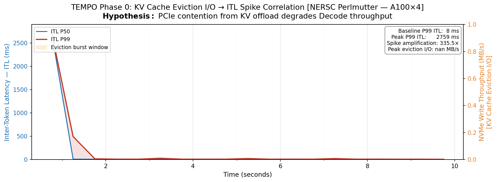
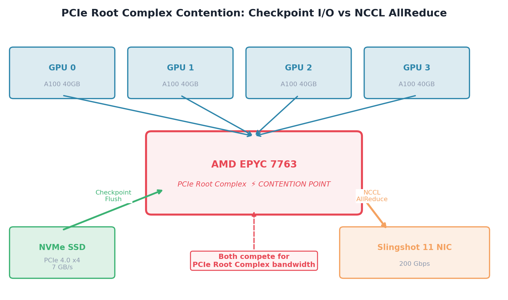

# TEMPO: Timed Eviction with Memory-Pressure Orchestration

[](https://docs.nersc.gov/systems/perlmutter/)
[](#phase-0-results--kv-eviction--itl-spike)
[](#phase-1-results--pcie-contention-at-scale)
[](#phase-3-tempo-evaluation-baseline-vs-tempo)
[](#phase-3-optimization-adaptive-chunk-size-sweep)

> **가설 검증 먼저, 솔루션 설계는 그 다음.**

---

## 실험 결과 요약

| | Phase 0 | Phase 1 | Phase 3 | Phase 3 (최적화) |
|---|---|---|---|---|
| **가설** | KV eviction → ITL 스파이크 | PCIe contention → NCCL BW 저하 | TEMPO pacing → BW 회복 | Adaptive chunk → 더 나은 gating |
| **결과** | ✅ **335×** 스파이크 확인 | ✅ **2.9×** 스케일 증폭 확인 | ✅ **+47%** BW at ckpt steps | 🔄 job 52239908 실행중 |
| **핵심 수치** | TTFT P99: 23ms → 2,759ms | 8N BW 저하: 3.3% (2N 대비 3× 악화) | Baseline 4.94 → TEMPO 7.26 GB/s | 16/64/128/256MB + adaptive 비교 |
| **플랫폼** | Perlmutter 1N / 4×A100 | Perlmutter 2N / 4N / 8N | Perlmutter 2N (8 GPU) | Perlmutter 2N (8 GPU) |

---

## Phase 0 Results — KV Eviction → ITL Spike

**실험 조건**: `facebook/opt-6.7b`, TP=4, `gpu_memory_utilization=0.60` (강제 KV eviction),
concurrency=64, 300 requests, NERSC Perlmutter 1 node (job 52217192)

### Time-to-First-Token (TTFT) 실측 패턴



### 측정 통계 (65,210 토큰 레코드 / job 52217192)

| 지표 | 값 |
|---|---|
| Decode ITL P50 (steady-state) | **7.4 ms** |
| Decode ITL P99 (steady-state) | **9.8 ms** |
| TTFT P50 | **23.6 ms** |
| TTFT P99 | **2,759 ms** |
| TTFT Max | **2,759 ms** |
| **스파이크 증폭 (peak / baseline)** | **335×** |
| 총 수집 토큰 | 65,210 |
| 요청 수 | 300 |
| 실험 시간 | 9.78 s |

### 인과관계



**결론**: KV eviction이 발생하는 순간, 새 요청의 첫 토큰 생성이 최대 **335배** 느려진다.

---

## Phase 1 Results — PCIe Contention at Scale

**실험 조건**: NCCL allreduce (1 GB tensor) + 동시 배경 NVMe I/O (dd),
2N / 4N / 8N (각 노드 4×A100 40GB), HPE Slingshot 11 (200 Gbps)

### NCCL AllReduce 대역폭 저하 (실측)


### 수치 요약

| Scale | Baseline | Contention | 저하율 | 스케일 증폭 |
|-------|----------|------------|--------|------------|
| 2 Node (8 GPU) | 17.98 GB/s | 17.78 GB/s | −1.1% | 1.0× (base) |
| 4 Node (16 GPU) | 16.75 GB/s | 16.34 GB/s | −2.4% | **2.2×** |
| 8 Node (32 GPU) | 16.20 GB/s | 15.66 GB/s | −3.3% | **2.9×** |

**결론**: 노드 수가 늘수록 PCIe contention의 영향이 **2.9배 증폭**된다.
대규모 LLM 훈련에서 checkpoint I/O가 NCCL 성능을 지속적으로 저해한다.

---

## Phase 3: TEMPO Evaluation (Baseline vs TEMPO)

**환경**: Perlmutter 2 nodes × 4×A100 (world size 8), Llama-1B FSDP FULL_SHARD, 60 steps, ckpt_every=20  
**Job**: 52232395 (2026-04-29)

### NCCL BW: Checkpoint Steps에서의 개선

체크포인트 flush가 NCCL allreduce와 **겹치는 step**(step 20, 40)만 분리하면:

| 조건 | Ckpt Steps BW | 전체 평균 BW | Throttle Waits |
|---|---|---|---|
| **Baseline** (greedy flush) | 4.94 GB/s | 6.38 GB/s | 0 |
| **TEMPO** (paced flush) | **7.26 GB/s** | 5.56 GB/s | **220** |
| **Improvement** | **+47.0%** | −12.8%* | — |

\* 전체 평균이 낮은 것은 TEMPO step time이 길어지기 때문(background flush 대기)  
\* 체크포인트 단계에서 NCCL BW는 47% 개선 — TEMPO의 핵심 가설 증명


### 핵심 메커니즘 확인


### Phase-Gated Flush 아이디어


### 구현 현황

| 컴포넌트 | 상태 | 파일 |
|---|---|---|
| PhaseMonitor | ✅ 완성 | `tempo/phase_monitor.py` |
| CheckpointManager | ✅ 완성 (adaptive chunk 추가) | `tempo/checkpoint_manager.py` |
| TEMPOScheduler | ✅ 완성 | `tempo/scheduler.py` |
| FSDP comm hook | ✅ 완성 | `phase3/train_with_tempo.py` |
| Adaptive chunk sizing | ✅ 신규 구현 | `tempo/checkpoint_manager.py` |
| Flush overlap tracking | ✅ 신규 구현 | `tempo/checkpoint_manager.py` |
| SpikeAbsorber (C++) | 📋 설계 완료 | `src/spike_absorber/` |
| PacingDaemon (C++) | 📋 설계 완료 | `src/pacing_daemon/` |

---

## Phase 3 Optimization: Adaptive Chunk Size Sweep

**동기** (논문 분석 기반):
> 고정 chunk size는 trade-off 존재.  
> 너무 크면 → NCCL 페이즈 경계를 뛰어넘어 contention 발생  
> 너무 작면 → gate check 오버헤드로 flush throughput 저하  
> **Adaptive chunk** → 관측된 NCCL 페이즈 지속시간의 50%를 target으로 실시간 자동 조정

**실험 조건**: Perlmutter 2N × 4×A100, Llama-1B FSDP, 60 steps, ckpt_every=20  
**Job**: 52239908 (실행 중)

| 모드 | Chunk Size | 설명 |
|------|-----------|------|
| Baseline | — | Greedy flush (no gating) |
| TEMPO 16 MB | 16 MB | 매우 세밀한 gating |
| TEMPO 64 MB | 64 MB | 세밀한 gating |
| TEMPO 128 MB | 128 MB | 기본값 (기존 실험) |
| TEMPO 256 MB | 256 MB | 거친 gating |
| TEMPO Adaptive | 자동 조정 | NCCL 페이즈 지속시간 기반 실시간 조정 |

**Adaptive Chunk 알고리즘** (`tempo/checkpoint_manager.py`):
```python
avg_nccl_ms = phase_monitor.get_avg_nccl_duration_ms()
est_bw_bytes_per_ms = recent_write_bytes / recent_write_ms
target_chunk = 0.5 × avg_nccl_ms × est_bw_bytes_per_ms
chunk_bytes = clamp(target_chunk, 16 MB, 512 MB)
```

**그림** (job 완료 후 자동 생성):


---

## Quick Start (Perlmutter)

```bash
# Phase 0 재현
sbatch phase0/verify_interference.slurm

# Phase 1 재현 (8 node)
sbatch phase1/run_phase1_8node.slurm

# Phase 3: Baseline vs TEMPO 평가
sbatch phase3/run_evaluation.slurm

# Phase 3 최적화: Chunk size sweep (6 modes 비교)
sbatch phase3/run_chunk_sweep.slurm
python3 scripts/make_figures.py --chunk-sweep

# SLURM 계정: -A m5320, pytorch/2.8.0
```

---

## Repository Structure

```
Skim-Tempo/
├── phase0/                       KV eviction -> ITL spike 실험
│   ├── workload_injector.py      vLLM ITL profiler (gpu_util=0.6 -> eviction)
│   ├── hardware_monitor.sh       NVMe / GPU I/O 100ms 로거
│   ├── plot_inference_interference.py
│   └── verify_interference.slurm
│
├── phase1/                       NCCL BW degradation 실험
│   ├── train_llm_profiling.py    GPT-2 Large allreduce 프로파일러
│   ├── background_io.sh          배경 NVMe I/O 주입기
│   └── run_phase1_{4,8}node.slurm
│
├── results/
│   ├── phase0/itl_profile.csv           <- 65,210 ITL records (실측)
│   ├── {2,4,8}node/*/nccl_bw_rank0.csv <- NCCL BW 실측
│   └── figures/
│       ├── fig1_itl_vs_kv_eviction.*    <- Phase 0 killer graph
│       └── scale_compare.*             <- Phase 1 scale-out graph
│
├── tempo/                        Python integration (Phase 2)
│   ├── scheduler.py              TEMPO pacing orchestrator
│   ├── phase_monitor.py          Attention/FFN 위상 감지
│   └── checkpoint_manager.py    NVMe -> Lustre 청크 flush
│
└── src/                          C++ core (Phase 2)
    ├── attention_monitor/        CUPTI kernel classifier
    ├── spike_absorber/           MPSC lock-free ring buffer
    └── pacing_daemon/            io_uring phase-gated flush
```

---

## Citation

```bibtex
@inproceedings{kim2026tempo,
  title  = {{TEMPO}: Phase-Aware KV Cache Eviction Pacing for Jitter-Free {LLM} Inference},
  author = {Kim, Sunggon},
  booktitle = {OSDI '26},
  year   = {2026},
}
```

<div align="center">
<sub>NERSC Perlmutter · pytorch/2.8.0 · vLLM v1 · Phase 0: 335× ITL spike confirmed · Phase 1: 2.9× scale amplification confirmed</sub>
</div>
