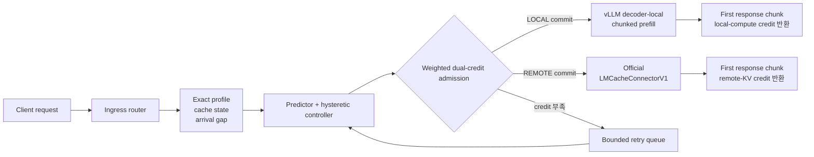
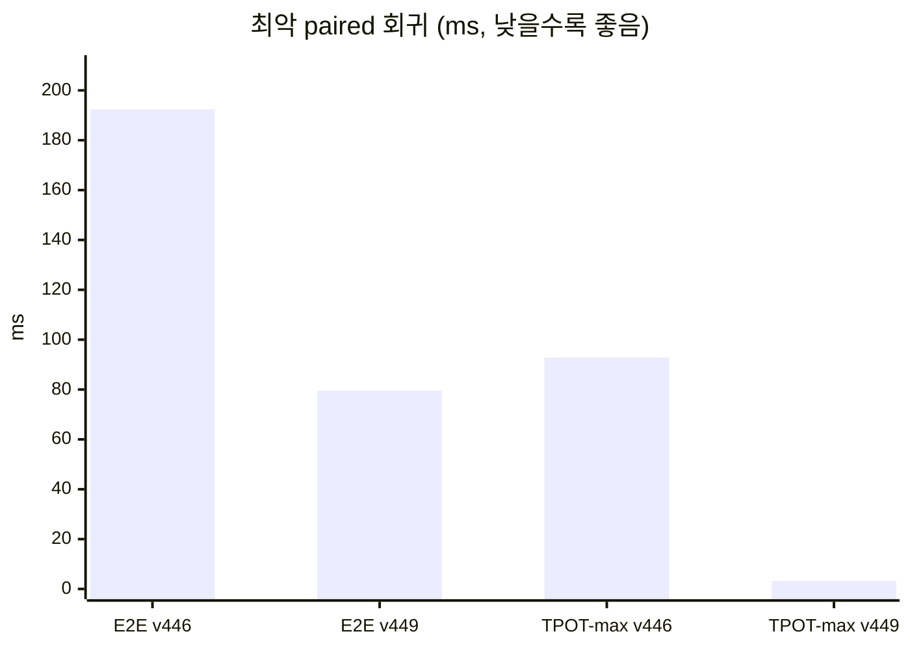

# TEMPO Elastic-PD

TEMPO Elastic-PD는 실제 vLLM Prefill/Decode(P/D) 환경에서 요청을 실행하기
전에 ingress가 경로를 한 번만 확정하는 admission controller 연구
프로토타입입니다. 각 요청을 decoder-local chunked prefill 또는 official
LMCache remote prefill로 보내며, local compute와 remote KV 용량을 서로 다른
credit으로 관리합니다.

## 현재 최종 결론 (2026-08-21)

원래 목표와 성공 조건은 바꾸지 않았습니다. 현실적인 phase-changing C4
contention workload에서 세 개의 구조적으로 다른 TEMPO candidate를 실제
4노드 vLLM P/D와 official `LMCacheConnectorV1:UCX` 경로로 검증했습니다.
정확성과 양쪽 route의 유용성은 확인했지만, 어느 candidate도 strongest-fixed
대비 median 개선과 tail 보장을 동시에 만족하지 못했습니다. 따라서 이
목표는 사전 명시한 stop condition에 따라 **재현 가능한 negative
conclusion**으로 종료합니다.

이 결론은 LMCache가 항상 느리거나 orchestration을 버려야 한다는 뜻이
아닙니다. C1 decoder-hot에서는 remote가 이겼고, C2 remote-path-hot에서는
local이 이겼습니다. Candidate C가 local로 고른 요청과 remote로 고른 요청도
각각 반대 경로 counterfactual보다 중앙값 기준 78.04%, 25.90% 빨랐습니다.
실패한 부분은 route 선택 자체가 아니라, 두 경로가 결국 같은 decoder로
합류하는 상황에서 median 이득과 TPOT/worst-tail isolation을 함께 만드는
것이었습니다.

## 한눈에 보는 결과

- 환경: Perlmutter A100 4노드, Qwen2.5-7B, 실제 vLLM TP4 P/D 2 replicas
- 비교군: always-local, official LMCache always-remote, predictor, full TEMPO
- workload: C0 cool, C1 decoder-hot, cold C2 remote-hot, KV C2 remote-hot,
  C3 both-hot, recovery; 두 counterbalanced replicate
- Candidate C: 8개 block × 1,283개 요청 전부 유효, paired foreground 360개
- exact output·stream·route·cache geometry·fallback·queue·credit 검증: 전부 통과

| Candidate | 핵심 신호 | fixed median | predictor median | goodput | paired win | TPOT p99 | worst regression |
|---|---|---:|---:|---:|---:|---:|---:|
| A | instant scalar score | -2.92% | +3.48% | +10.17% | 68.89% | +44.53% | +2506.4 ms |
| B | active-request watermark epoch | +7.10% | +17.46% | +7.67% | 76.11% | +64.28% | +997.9 ms |
| C | route-pinned local-credit epoch | +7.92% | +21.30% | +4.58% | 75.56% | +49.41% | +2278.7 ms |

세 candidate 모두 10% fixed-median gate와 tail bundle을 동시에 통과한 횟수가
0회입니다. hidden phase label을 허용한 진단용 oracle도 세 trace 모두 full
gate에 실패했으므로 threshold를 다시 미세 조정하지 않습니다.

- [최종 표와 판정](paper/tempo_pd_c4_negative_report_v1/negative_conclusion_report.md)
- [Candidate C pooled E2E/TTFT/TPOT/goodput](paper/tempo_pd_c4_negative_report_v1/candidate_c_pooled_metrics.svg)
- [Candidate C workload별 E2E/TTFT/TPOT/goodput](paper/tempo_pd_c4_negative_report_v1/candidate_c_phase_metrics.svg)

## 구현 구조



### 1. 실행 전 one-way route commit

Ingress는 upstream을 시작하기 전에 `LOCAL`, `REMOTE`, `QUEUE` 중 하나를
결정합니다. 실행이 시작된 요청을 중간에 다른 경로로 옮기지 않으므로,
중복 prefill이나 부분 실행 후 fallback으로 인한 숨은 비용을 만들지
않습니다.

### 2. 자원별 weighted dual credit

- local path는 profile에서 추정한 prefill compute cost를 사용합니다.
- remote path는 실제 prompt geometry로 계산한 potential KV bytes를
  사용합니다.
- 두 자원을 하나의 request-count cap으로 뭉개지 않고 별도 budget으로
  admission합니다.

### 3. phase-correct credit lifetime

v447에서는 prefill/KV admission credit을 전체 autoregressive decode가 끝날
때까지 잘못 보유해 4개 요청이 250 ms queue timeout으로 실패했습니다.
v449는 첫 streamed response chunk에서 credit을 반환합니다. 즉 credit이
표현하는 prefill 또는 remote handoff 단계가 끝나는 시점과 lease lifetime을
맞춥니다.

초기 v449의 48/48 TEMPO 요청에서 다음 lifecycle이 검증됐고, C4에서도 같은
one-way/release invariant가 유지됐습니다.

```text
route commit → upstream start → first response chunk / credit release
             → remaining decode stream → completion
```

4개 요청은 bounded queue에서 정상 재시도됐고, terminal queue와 route
error는 각각 0건이었습니다.

### 4. load hysteresis와 recovery probe

Arrival-gap window로 `remote_stable`과 `deflect_active` regime을 구분하며,
낮은 부하가 연속으로 확인된 뒤에만 한 개의 explicit remote recovery probe를
허용합니다. 단일 gap 변화로 전체 정책을 즉시 뒤집지 않습니다.

### 5. cache-aware, fail-closed routing

Controller는 `P_ONLY`, `D_ONLY`, `BOTH`, `confirmed_miss`를 구분합니다.
검증되지 않은 cache hint는 hit로 간주하지 않고 `confirmed_miss`로
처리합니다. 초기 v449는 cold screen이었고, 현재 C4는 MISS/P_ONLY/D_ONLY/BOTH
geometry를 route별 local/external cached-token proof로 검증합니다. 이 범위를
넘는 cache-hit 일반화는 주장하지 않습니다.

## v446에서 v449까지: 보존된 historical mechanism evidence

v446은 중앙값과 승률은 좋았지만 최악 E2E 회귀가 guardrail을 넘었습니다.
Local credit을 1개로 줄인 v447은 phase lifetime 오류를 드러냈고, v449가
first-response release로 이를 고쳤습니다.



| 지표 | v446 | v449 | 변화 |
|---|---:|---:|---:|
| E2E 승리 | 42/48 | **45/48** | +3 wins |
| 최악 E2E 회귀 | 192.362 ms | **79.562 ms** | -58.64% |
| 최악 TPOT-max 회귀 | 92.808 ms | **3.297 ms** | -96.45% |
| terminal queue/error | 0 | **0** | 유지 |

이 결과는 “budget을 크게 잡으면 된다”가 아니라 admission credit의 자원
단계와 반환 시점이 일치해야 한다는 점을 보여줍니다.
이 48-request 결과는 현재 최종 performance claim이 아니며, 위 C4 A/B/C
screen과 terminal negative verdict가 최신 결론입니다.

## 검증 범위

최종 감사에서는 endpoint profile/service, endpoint probe, C4 node/client,
semantic profile builder, router, semantic analyzer, negative analyzer,
report renderer를 포함한 **89 tests + 11 subtests**가 통과했습니다. 테스트,
artifact 분석, plot 생성도 로그인 노드가 아니라 유지 중인 4노드 GPU
interactive allocation의 compute node에서 실행했습니다.

```bash
.vllm_venv/bin/python -m pytest -q \
  tempo/test_pd_endpoint_profile.py \
  eval/sota_4node/test_build_tempo_pd_endpoint_service_profile.py \
  eval/sota_4node/test_tempo_pd_endpoint_probe.py \
  eval/sota_4node/test_vllm_lmcache_pd_c4_phase_screen_node.py \
  eval/sota_4node/test_build_tempo_pd_semantic_epoch_endpoint_profile.py \
  eval/sota_4node/test_tempo_pd_endpoint_feedback_router.py \
  eval/sota_4node/test_tempo_pd_elastic_router.py \
  eval/sota_4node/test_analyze_tempo_pd_c4_semantic_epoch_screen.py \
  eval/sota_4node/test_run_tempo_pd_c4_phase_screen_client.py \
  eval/sota_4node/test_analyze_tempo_pd_c4_negative_conclusion.py \
  eval/sota_4node/test_render_tempo_pd_c4_negative_report.py
```

Perlmutter GPU 실험은 계속 4노드×4시간 interactive allocation 안에서만
수행합니다. 로그인 노드는 bounded source edit와 가벼운 상태 확인에만
사용합니다.

## 증거와 claim boundary

Authoritative local artifacts:

- Candidate C frozen profile:
  `eval/sota_4node/real_tempo_pd_endpoint_service_profile_c4_semantic_credit_epoch_v2.json`
- LMCache runtime delta and verifier:
  `eval/sota_4node/lmcache_tempo_c4_runtime.patch`,
  `eval/sota_4node/apply_tempo_pd_c4_lmcache_patch.sh`
- Candidate C contract:
  `eval/sota_4node/tempo_pd_c4_semantic_credit_epoch_candidate_v7_contract.json`
- live result and phase analysis:
  `results/tempo_pd_c4_semantic_credit_epoch_candidate_v7_job_57362947/`
- terminal SHA-bound verdict:
  `paper/tempo_pd_c4_negative_report_v1/negative_conclusion_analysis_v2.json`
- local tables/plots and manifest: `negative_report_v3/`
- Git compact tables/plots:
  `paper/tempo_pd_c4_negative_report_v1/`
- full lineage/prior-work/claim audit:
  `paper/TEMPO_ELASTIC_PD_CONTENTION_AUDIT.md`

현재 허용되는 주장은 다음과 같습니다.

> Perlmutter A100 4노드의 실제 vLLM P/D와 unchanged official
> `LMCacheConnectorV1:UCX` data plane에서, frozen C4 dynamic-contention
> workload에 적용한 세 개의 request-level TEMPO admission/routing
> candidate가 correctness와 양 route의 유용성은 입증했지만 원래의
> median+tail gate를 동시에 만족하지 못했다.

다음은 주장하지 않습니다.

- 다른 모델·context·topology로의 일반화
- LMCache transport 또는 remote 경로의 보편적 열위
- 정확한 Slingshot switch-level bottleneck 위치
- Mooncake와의 apples-to-apples 비교
- production readiness, production-scale novelty, 보편적 SOTA
- 모든 cluster orchestration이 답이 없다는 주장

Production/HPC-scale 후속 연구를 한다면 decoder admission, tenant
fairness/SLO, P/D pair dispatch, replica organization/scaling, endpoint
recovery를 함께 다뤄야 합니다. 이는 현재 route-only 목표의 threshold를 더
튜닝하는 것이 아니라 별도 preregistration이 필요한 새 연구 문제입니다.

Frozen LMCache runtime은 upstream commit
`227d13f5c9fdb52ddb933641d34331f678de03a0` checkout에 다음 명령으로
복원합니다. Script는 patch 적용 전 HEAD를, 적용 후 여섯 runtime 파일의
SHA-256을 fail-closed로 확인합니다.

```bash
bash eval/sota_4node/apply_tempo_pd_c4_lmcache_patch.sh
```

## 저장소 구성

- `tempo/`: Elastic-PD controller, admission/profile model, CPU invariants
- `eval/sota_4node/`: actual vLLM P/D router, workload runner, analyzer,
  명시적으로 승인된 Slurm entrypoint
- `results/`: 로컬 raw experiment artifacts; 대용량 결과와 Slurm log는 Git에
  올리지 않음
- `paper/`: 이전 checkpoint TEMPO-RD 연구와 negative evidence

## NERSC 안전

Perlmutter에서 작업하기 전에 `NERSC_AGENT_SAFETY.md`를 읽으십시오. 시스템
및 shared filesystem을 재귀 탐색하지 말고, 사용자의 명시적 승인 없이 Slurm
job을 제출·취소·재시도하지 마십시오.
