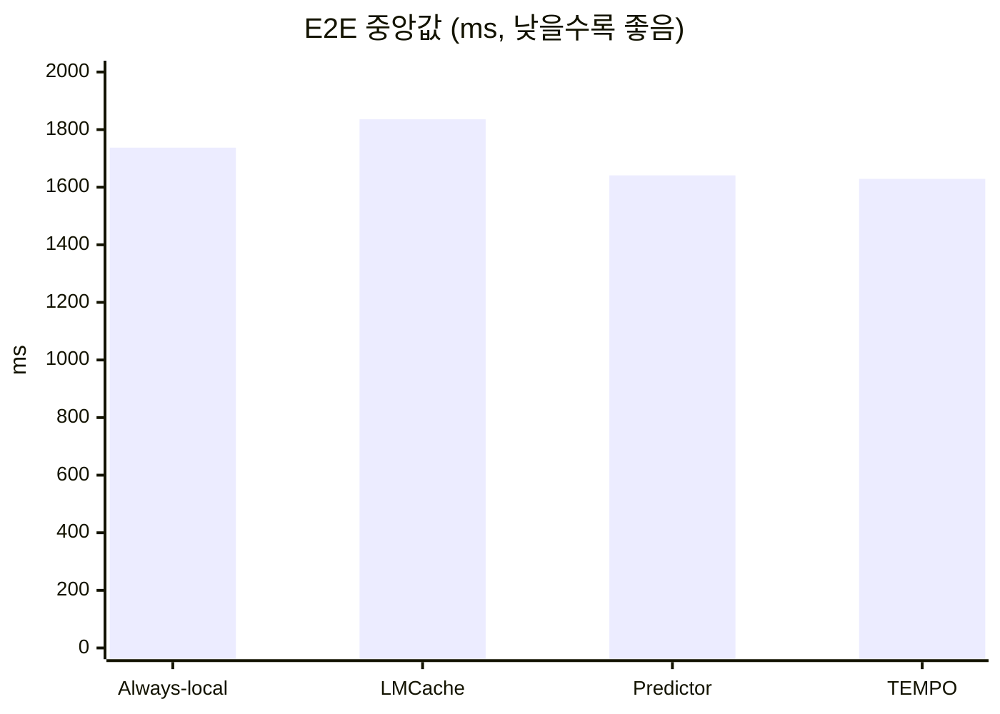
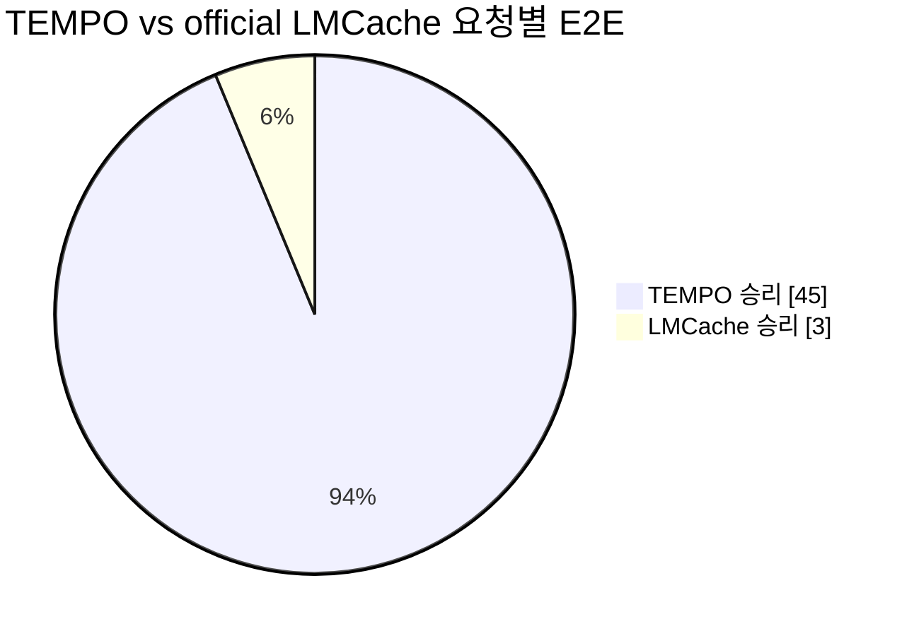
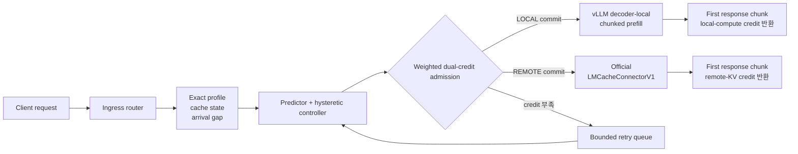
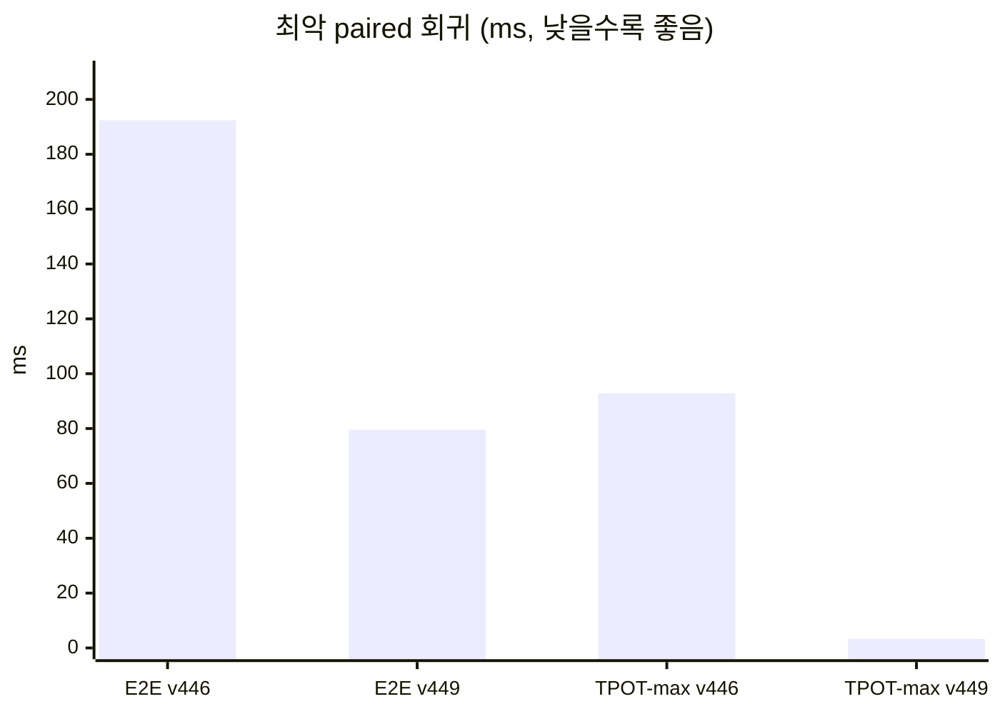

# TEMPO Elastic-PD

TEMPO Elastic-PD는 실제 vLLM Prefill/Decode(P/D) 환경에서 요청을 실행하기
전에 ingress가 경로를 한 번만 확정하는 admission controller 연구
프로토타입입니다. 각 요청을 decoder-local chunked prefill 또는 official
LMCache remote prefill로 보내며, local compute와 remote KV 용량을 서로 다른
credit으로 관리합니다.

현재 결론은 명확합니다. 검증된 4노드 workload에서 full TEMPO가 official
LMCache always-remote보다 빠르면서 정확성을 유지했습니다. 다만 이는 해당
topology와 frozen workload에 한정된 결과이며 보편적 SOTA 주장은 아닙니다.

## 한눈에 보는 결과

- 환경: Perlmutter A100 4노드, Qwen2.5-7B, 실제 vLLM TP4 P/D 2 replicas
- 비교군: always-local, official LMCache always-remote, predictor, full TEMPO
- 측정: 한 live server epoch에서 동일한 48개 요청을 arm별 paired 비교
- TEMPO E2E delta 중앙값: **-209.356 ms** vs official LMCache
- TEMPO E2E 승리: **45/48 (93.75%)**
- 최악 E2E 회귀: **+79.562 ms** — 사전 guardrail 100 ms 이내
- stream·route·KV geometry·output 검증: **전부 통과**



| Arm | E2E 중앙값 (ms) | TTFT 중앙값 (ms) | TPOT 중앙값 (ms) | 요청별 TPOT-max 최댓값 (ms) |
|---|---:|---:|---:|---:|
| Always-local | 1737.351 | 84.000 | 22.483 | 94.509 |
| Official LMCache always-remote | 1835.751 | 82.555 | 22.087 | 764.046 |
| Predictor | 1641.057 | 80.861 | 21.916 | 548.637 |
| **Full TEMPO** | **1629.016** | **79.183** | **21.789** | **531.945** |



`-209.356 ms`는 요청별 `TEMPO - LMCache` delta의 중앙값입니다. arm별
중앙값의 단순 차이인 `1629.016 - 1835.751 = -206.736 ms`와는 다른
통계량입니다.

## 구현 구조



### 1. 실행 전 one-way route commit

Ingress는 upstream을 시작하기 전에 `LOCAL`, `REMOTE`, `QUEUE` 중 하나를
결정합니다. 실행이 시작된 요청을 중간에 다른 경로로 옮기지 않으므로,
중복 prefill이나 부분 실행 후 fallback으로 인한 숨은 비용을 만들지
않습니다.

### 2. 자원별 weighted dual credit

- local path는 profile에서 추정한 prefill compute cost를 사용합니다.
- remote path는 실제 prompt geometry로 계산한 potential KV bytes를
  사용합니다.
- 두 자원을 하나의 request-count cap으로 뭉개지 않고 별도 budget으로
  admission합니다.

### 3. phase-correct credit lifetime

v447에서는 prefill/KV admission credit을 전체 autoregressive decode가 끝날
때까지 잘못 보유해 4개 요청이 250 ms queue timeout으로 실패했습니다.
v449는 첫 streamed response chunk에서 credit을 반환합니다. 즉 credit이
표현하는 prefill 또는 remote handoff 단계가 끝나는 시점과 lease lifetime을
맞춥니다.

48/48 TEMPO 요청에서 다음 lifecycle이 검증됐습니다.

```text
route commit → upstream start → first response chunk / credit release
             → remaining decode stream → completion
```

4개 요청은 bounded queue에서 정상 재시도됐고, terminal queue와 route
error는 각각 0건이었습니다.

### 4. load hysteresis와 recovery probe

Arrival-gap window로 `remote_stable`과 `deflect_active` regime을 구분하며,
낮은 부하가 연속으로 확인된 뒤에만 한 개의 explicit remote recovery probe를
허용합니다. 단일 gap 변화로 전체 정책을 즉시 뒤집지 않습니다.

### 5. cache-aware, fail-closed routing

Controller는 `P_ONLY`, `D_ONLY`, `BOTH`, `confirmed_miss`를 구분합니다.
검증되지 않은 cache hint는 hit로 간주하지 않고 `confirmed_miss`로
처리합니다. 이번 GPU workload는 first-chunk marker를 요청별로 분리한 cold
screen이므로 cache-hit 성능을 주장하지 않습니다.

## v446에서 v449까지: 실험으로 찾은 핵심 수정

v446은 중앙값과 승률은 좋았지만 최악 E2E 회귀가 guardrail을 넘었습니다.
Local credit을 1개로 줄인 v447은 phase lifetime 오류를 드러냈고, v449가
first-response release로 이를 고쳤습니다.



| 지표 | v446 | v449 | 변화 |
|---|---:|---:|---:|
| E2E 승리 | 42/48 | **45/48** | +3 wins |
| 최악 E2E 회귀 | 192.362 ms | **79.562 ms** | -58.64% |
| 최악 TPOT-max 회귀 | 92.808 ms | **3.297 ms** | -96.45% |
| terminal queue/error | 0 | **0** | 유지 |

이 결과는 “budget을 크게 잡으면 된다”가 아니라 admission credit의 자원
단계와 반환 시점이 일치해야 한다는 점을 보여줍니다.

## 검증 범위

최종 CPU 감사에서는 controller, cache-residency policy, exact profile,
one-way router lifecycle, cache isolation, weighted credit, strengthened
analyzer를 포함한 **21/21 테스트**가 통과했습니다.

```bash
PYTHONDONTWRITEBYTECODE=1 .vllm_venv/bin/python -m unittest -v \
  tempo.test_pd_elastic_controller_v443 \
  tempo.test_pd_elastic_cache_residency_v450 \
  tempo.test_pd_elastic_profile_v444 \
  eval.sota_4node.test_tempo_pd_elastic_router_v445 \
  eval.sota_4node.test_tempo_pd_elastic_router_v449 \
  eval.sota_4node.test_tempo_pd_elastic_cache_isolation_v446 \
  eval.sota_4node.test_tempo_pd_elastic_weighted_local_v447 \
  eval.sota_4node.test_analyze_tempo_pd_elastic_balanced_v450
```

GPU 실험은 `run_tempo_pd_elastic_v449_in_allocation.sh`로 수행했으며,
Perlmutter에서는 반드시 `NERSC_AGENT_SAFETY.md`를 먼저 읽고 명시적으로
승인된 기존 allocation 안에서만 실행해야 합니다.

## 증거와 claim boundary

Authoritative local artifacts:

- profile: `eval/sota_4node/real_tempo_pd_elastic_profile_v447.json`
- result: `results/tempo_elastic_pd_v449_job_57086357/elastic_pd_final_v450.json`
- compact evidence: `eval/sota_4node/TEMPO_ELASTIC_PD_V449_EVIDENCE.md`

현재 허용되는 주장은 다음과 같습니다.

> Perlmutter A100 4노드, Qwen2.5-7B, 실제 vLLM TP4 P/D 2-replica,
> frozen confirmed-miss workload에서 TEMPO ingress admission policy가 동일
> 요청·KV geometry·GPU budget의 official LMCache always-remote arm보다 낮은
> paired E2E를 보였고, exact output과 사전 tail guardrail을 만족했다.

다음은 아직 증명하지 않았습니다.

- 독립 allocation 재현성
- 실제 cache-hit workload 성능
- 다른 모델·context·topology로의 일반화
- 새로운 transport 또는 LMCache 자체 data plane보다 빠르다는 주장
- Mooncake와의 apples-to-apples 비교
- 보편적 SOTA 또는 “항상 더 빠르다”는 주장

따라서 이 저장소는 검증된 Elastic-PD 연구 프로토타입이지 production-ready
router나 보편적 최고 성능 시스템이 아닙니다.

## 저장소 구성

- `tempo/`: Elastic-PD controller, admission/profile model, CPU invariants
- `eval/sota_4node/`: actual vLLM P/D router, workload runner, analyzer,
  명시적으로 승인된 Slurm entrypoint
- `results/`: 로컬 raw experiment artifacts; 대용량 결과와 Slurm log는 Git에
  올리지 않음
- `paper/`: 이전 checkpoint TEMPO-RD 연구와 negative evidence

## NERSC 안전

Perlmutter에서 작업하기 전에 `NERSC_AGENT_SAFETY.md`를 읽으십시오. 시스템
및 shared filesystem을 재귀 탐색하지 말고, 사용자의 명시적 승인 없이 Slurm
job을 제출·취소·재시도하지 마십시오.
