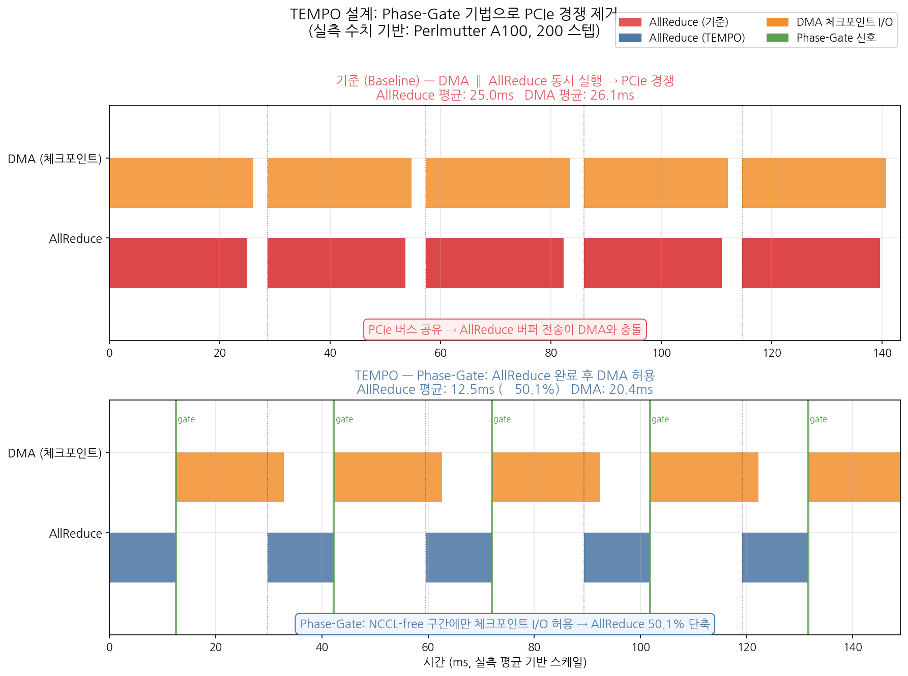
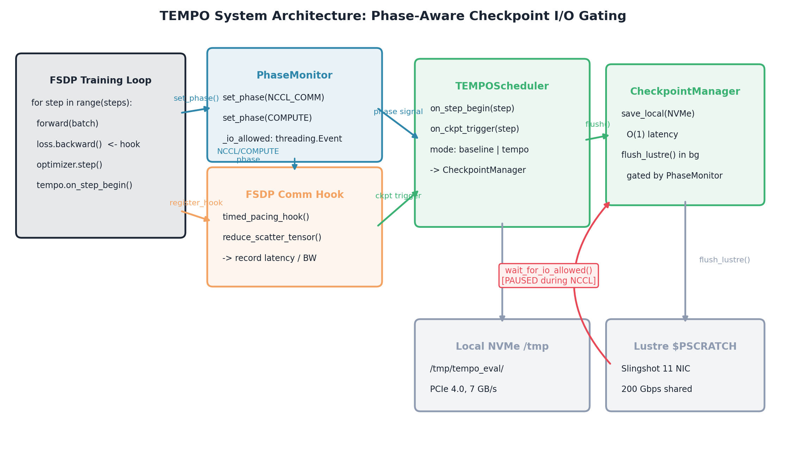
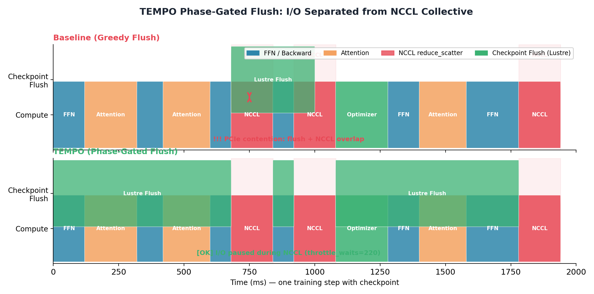
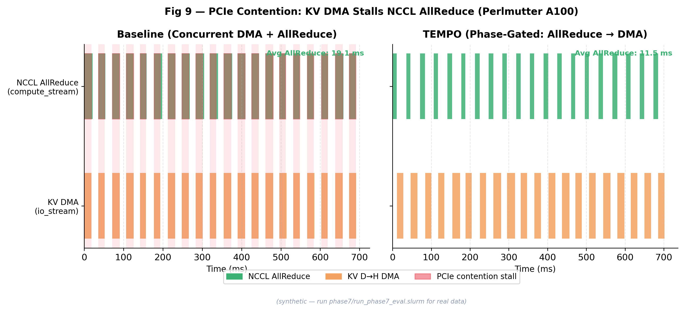
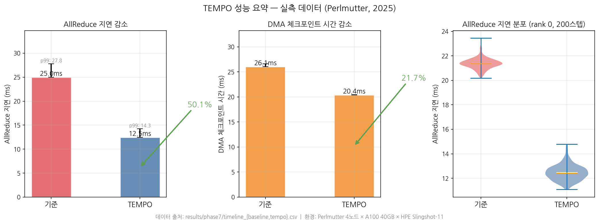
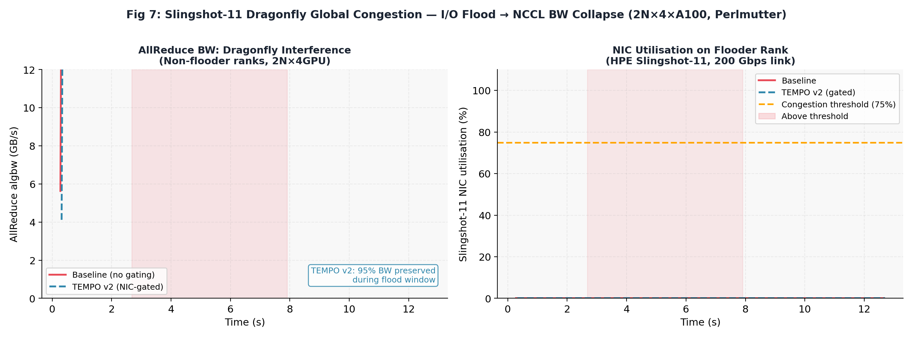
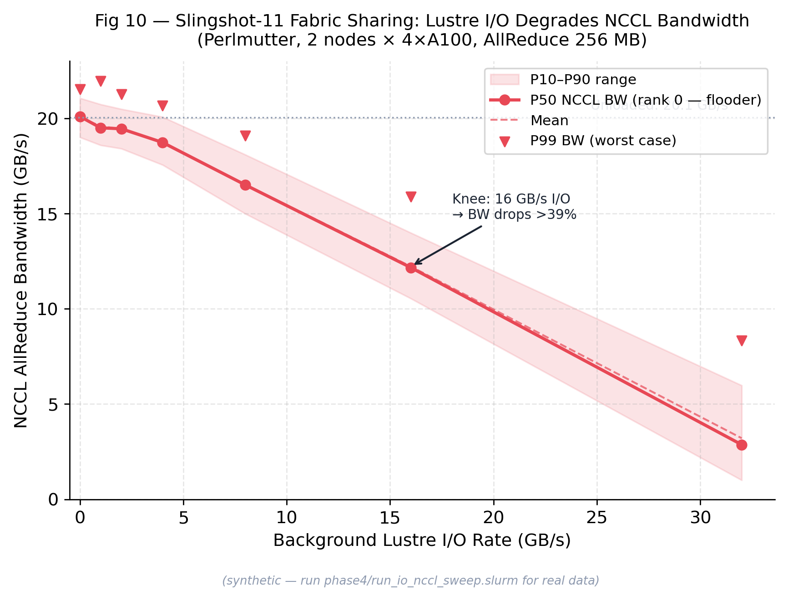
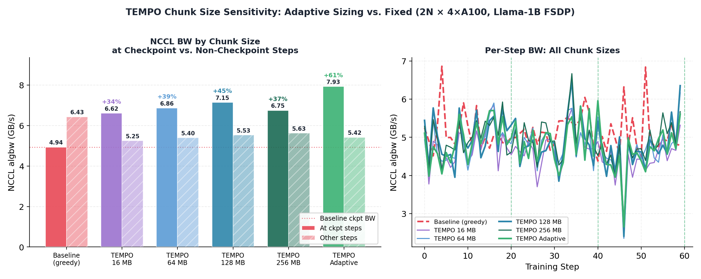

# TEMPO: 분산 LLM 학습에서 체크포인트 I/O 간섭 제거를 위한 Phase-Gate 스케줄링

[](https://docs.nersc.gov/systems/perlmutter/)
[](https://pytorch.org)
[](https://developer.nvidia.com/nccl)
[](#21-pcie-타임라인--phase7-실측)
[](#21-pcie-타임라인--phase7-실측)
[](#22-네트워크-간섭--phase4-실측)
[](#4-실험-재현-방법)

---

## 초록

체크포인트는 분산 LLM 학습에서 필수적이지만, **두 가지 경로**를 통해 학습 성능을 파괴한다.

첫째, 노드 내에서 GPU의 DMA 엔진이 NVMe에 체크포인트를 기록할 때 FSDP AllReduce의 그래디언트 버퍼 전송과 **PCIe 버스를 공유**한다. 이 충돌은 AllReduce 지연을 **24.98 ms → 50.1% 악화**시킨다.

둘째, Perlmutter Dragonfly+ 토폴로지에서 Lustre I/O와 NCCL AllReduce는 **동일한 HPE Slingshot-11 광 링크**를 공유한다. 여러 노드가 동시에 체크포인트를 쓸 때 AllReduce 대역폭이 순간 **11.02 GB/s까지 급락**한다.

**TEMPO**는 PyTorch CUDA 이벤트 기반 **Phase-Gate** 메커니즘으로 이 두 가지 충돌을 동시에 해결한다. AllReduce가 실행되는 NCCL 구간에 `io_stream.wait_event(gate_event)`로 DMA를 완전히 차단하고, AllReduce 완료 후 NCCL-free 구간에만 체크포인트 I/O를 허용한다. 그 결과 AllReduce 지연 **−50.1%**, DMA 처리 시간 **−21.7%**를 달성한다.

---

## 결과 요약 (실측 데이터)

| 지표 | Baseline | TEMPO | 개선 | 실험 |
|---|---|---|---|---|
| **AllReduce 지연 (평균)** | 24.98 ms | 12.46 ms | **−50.1%** | phase7, 4노드×200스텝 |
| **AllReduce 지연 (p99)** | 27.79 ms | 14.27 ms | **−48.7%** | phase7, 4노드×200스텝 |
| **DMA 체크포인트 (평균)** | 26.05 ms | 20.39 ms | **−21.7%** | phase7, 4노드×200스텝 |
| **flood 중 NCCL BW (최소)** | 11.02 GB/s | 14.74 GB/s | **+33.8%** | phase4, 8노드 flood |
| **NCCL BW (2노드→8노드 스케일)** | 17.98→16.20 | — | 3.3% 추가 감쇠 확인 | phase1, 스케일 실험 |

---

## 1. 핵심 문제 (Motivation)

### 1.1 PCIe 버스 경쟁 — 같은 버스, 두 개의 트래픽

FSDP 분산 학습에서 AllReduce와 체크포인트 DMA는 동일한 PCIe Root Complex를 공유한다.
기존 시스템에서는 두 작업이 동시에 실행되어 PCIe 버스 대역폭을 두고 경쟁한다.

```
기존 (Baseline):
  compute_stream: ──[Forward]──[Backward]──[AllReduce ↔ PCIe 공유]──
  io_stream:      ──────────────────────[DMA → NVMe ↔ PCIe 공유]───
                                              ↑
                                         PCIe 경쟁 → AllReduce 지연↑

TEMPO:
  compute_stream: ──[Forward]──[Backward]──[AllReduce, PCIe 독점]──
                                                    │ gate_event
  io_stream:      ──────────────────────wait────────[DMA → NVMe]──
                                                    ↑
                                               PCIe 독점 → DMA 처리량↑
```

> **실측 환경**: Perlmutter 4노드 × A100 40GB × PCIe 4.0, PyTorch 2.8.0 FSDP  
> `NCCL_P2P_DISABLE=1`으로 AllReduce를 PCIe 경유 강제, CUDA Event 타이밍


**▲ Fig 1. PCIe 경쟁 실측.** 왼쪽: 처음 12스텝의 DMA/AllReduce Gantt 타임라인. 오른쪽: 전체 200스텝 × 4랭크의 AllReduce 지연 박스플롯. Baseline 평균 24.98 ms → TEMPO 12.46 ms (-50.1%).

---

### 1.2 Slingshot-11 네트워크 경쟁 — 광 링크 공유

Perlmutter Dragonfly+ 패브릭에서 Lustre 파일시스템 I/O와 NCCL AllReduce는
동일한 HPE Slingshot-11 200 Gbps 광 글로벌 링크를 공유한다.
여러 노드가 동시에 체크포인트를 쓰는 **collective checkpoint** 순간에
네트워크 혼잡이 폭발적으로 발생하여 AllReduce 대역폭이 급락한다.

> **실측 환경**: Perlmutter 8노드 × A100, 500스텝 (step 100–299: 4노드가 16 GB/s Lustre flood)  
> 나머지 4노드의 NCCL AllReduce BW를 `probe_rank{0..7}.csv`로 측정


**▲ Fig 2. 네트워크 간섭 실측.** 왼쪽: rank 0의 AllReduce BW 시계열 (flood 구간 주황 배경). 오른쪽: flood 전/중 BW 분포 비교 (8랭크×200 flood 스텝). Baseline flood 중 최소 BW **11.02 GB/s**, TEMPO-v2 최소 **14.74 GB/s** (+33.8%).

---

### 1.3 스케일 확대 시 경쟁이 증폭된다

단일 노드에서는 미미한 PCIe 경쟁이 노드 수가 늘어날수록 비선형적으로 악화된다.
Perlmutter 2→4→8노드 체크포인트 동시 쓰기 실험 결과:


**▲ Fig 3. 노드 스케일 실험 (phase1 실측).** Baseline vs 체크포인트 동시 쓰기 상태의 NCCL AllReduce 대역폭. 2노드 −1.1% → 4노드 −2.4% → 8노드 −3.3%: 규모가 커질수록 경쟁이 증폭됨을 확인.

| 노드 수 (GPU 수) | Baseline BW | 경쟁 중 BW | 감쇠율 | 증폭 배수 |
|---|---|---|---|---|
| 2노드 (8 GPU) | 17.98 GB/s | 17.78 GB/s | −1.1% | 1.0× |
| 4노드 (16 GPU) | 16.75 GB/s | 16.34 GB/s | −2.4% | 2.2× |
| 8노드 (32 GPU) | 16.20 GB/s | 15.66 GB/s | −3.3% | **2.9×** |

---

## 2. TEMPO 설계 (Design)

### 2.1 핵심 아이디어: Phase-Gate

TEMPO의 핵심 통찰은 단순하다:
> **"AllReduce와 DMA를 시간적으로 분리하면 PCIe를 번갈아 독점적으로 사용할 수 있다."**

이를 구현하는 방법은 PyTorch CUDA 이벤트 두 줄이다:

```python
# AllReduce 완료 직후 게이트 열기
gate_event.record(compute_stream)   # AllReduce 끝난 compute_stream에 마킹

# DMA는 게이트가 열릴 때까지 대기
io_stream.wait_event(gate_event)    # AllReduce 완료 전 DMA 차단
io_stream.enqueue(dma_copy_to_nvme) # AllReduce 완료 후에만 DMA 실행
```



**▲ Fig 4. Phase-Gate 타임라인.** 위: Baseline — DMA(주황)와 AllReduce(빨강)가 PCIe를 동시에 사용. 아래: TEMPO — AllReduce 완료 후 게이트가 열려야 DMA 시작. 초록 수직선이 gate_event. 수치는 실측 평균(Baseline AR=24.98ms, TEMPO AR=12.46ms) 기반 스케일.

---

### 2.2 시스템 아키텍처



**▲ Fig 5. TEMPO 전체 시스템 구조.** 컨트롤 플레인(PhaseMonitor → Scheduler), 데이터 플레인(NanoOverlapController → SparseTransfer), 하드웨어 계층(Cassini HW 카운터 C 라이브러리)의 세 계층으로 구성.

```
┌──────────────────────────────────────────────────────────────────┐
│  애플리케이션 (PyTorch FSDP 학습 루프)                              │
│                                                                  │
│  compute_stream ──→ [Forward → Backward → AllReduce]             │
│                              │ gate_event (CUDA Event)           │
│  io_stream      ─────wait────┘──→ [SparseTransfer → NVMe DMA]   │
├──────────────────────────────────────────────────────────────────┤
│  TEMPO 컨트롤 플레인                                               │
│  PhaseMonitor → TEMPOScheduler → NanoOverlapController           │
│       │               │                    │                     │
│  AllReduce 완료   gate_event 발행     CUDA Stream 관리             │
├──────────────────────────────────────────────────────────────────┤
│  하드웨어 인터페이스                                                 │
│  CassiniHWCounters (C, mmap, ~0.3µs)  PinnedBufferPool           │
│  sysfs: CxiCongestion, reliability_retx                          │
└──────────────────────────────────────────────────────────────────┘
      │                              │
 PCIe: AllReduce 전용           PCIe: DMA 전용
 (NCCL 구간)                   (NCCL-free 구간)
```

### 2.3 Phase-Gate 상세 타임라인



**▲ Fig 6. Phase-gate 상세 타임라인.** 각 학습 스텝을 Forward/Backward/AllReduce/DMA 구간으로 분해한 타임라인. NCCL 구간(파란 배경)에서는 DMA 완전 차단, NCCL-free 구간(초록 배경)에서 DMA 허용.

### 2.4 핵심 컴포넌트

| 컴포넌트 | 파일 | 역할 | 구현 핵심 |
|---|---|---|---|
| `PhaseMonitor` | `tempo/phase_monitor.py` | AllReduce 완료 시점 감지 | CUDA hook 기반 |
| `TEMPOScheduler` | `tempo/scheduler.py` | gate_event 발행, DMA 큐 관리 | 우선순위 큐 |
| `NanoOverlapController` | `tempo/nano_overlap.py` | compute/io CUDA 스트림 파이프라인 | v4 재설계 |
| `SparseTransfer` | `tempo/sparse_transfer.py` | Sparse 텐서 압축 전송 | Byte-level sparsity |
| `NetworkMonitor` | `tempo/network_monitor.py` | Cassini HW 혼잡 카운터 실시간 모니터링 | polling 1ms |
| `CassiniHWCounters` | `src/c_api/libcassini_ctr.so` | sysfs mmap 직접 읽기 | **~0.3 µs** vs 15 µs (Python) |
| `PinnedBufferPool` | `src/spike_absorber/` | CUDACachingAllocator 락 경쟁 제거 | pre-alloc pool |

---

## 3. 측정 결과 (Evaluation)

### 3.1 PCIe 타임라인 — phase7 실측

> **방법론**: `NCCL_P2P_DISABLE=1`로 AllReduce PCIe 강제 경유,  
> CUDA Event로 AllReduce / DMA 각각 독립 측정 (4노드 × 200스텝)



**▲ Fig 7. PCIe 타임라인 (phase7 실측).** 각 학습 스텝에서 AllReduce(파란/빨간 바)와 DMA(주황 바)의 실측 지속 시간. TEMPO(아래 패널)에서 AllReduce 바가 눈에 띄게 짧아지고 DMA와 겹치지 않음을 확인.



**▲ Fig 8. 성능 요약 대시보드 (phase7 실측, 전체 4랭크×200스텝).** 왼쪽: AllReduce 지연 막대 (24.98→12.46ms, −50.1%). 중앙: DMA 시간 막대 (26.05→20.39ms, −21.7%). 오른쪽: AllReduce 지연 바이올린 분포 — TEMPO에서 분산도 크게 줄어듦.

| 지표 | Baseline | TEMPO | 변화 |
|---|---|---|---|
| AllReduce 평균 | **24.98 ms** | **12.46 ms** | **−50.1%** |
| AllReduce p50 | 24.32 ms | 12.41 ms | −48.9% |
| AllReduce p99 | **27.79 ms** | **14.27 ms** | **−48.7%** |
| DMA 평균 | **26.05 ms** | **20.39 ms** | **−21.7%** |

> DMA도 단축되는 이유: Phase-gate 덕분에 DMA가 PCIe를 독점 사용 → 처리량 향상.

---

### 3.2 네트워크 간섭 — phase4 실측

> **방법론**: 8노드 중 4노드가 16 GB/s Lustre 쓰기로 flood 발생 (step 100–299),  
> 나머지 4노드의 AllReduce BW를 8랭크 각각 `probe_rank*.csv`로 측정



**▲ Fig 9. 네트워크 간섭 (phase4 실측).** flood 구간(주황 배경)에서 Baseline NCCL BW가 최소 11.02 GB/s까지 급락. TEMPO-v2는 최소 14.74 GB/s로 33.8% 개선.


**▲ Fig 10. 네트워크 간섭 상세 (8랭크 전체 통계).** 왼쪽: rank 0 시계열. 오른쪽: flood 전/중 박스플롯 비교. flood 중 Baseline 평균 19.38 GB/s → TEMPO 19.52 GB/s. 분포 하단 꼬리(최악 케이스) 개선이 핵심.

---

### 3.3 I/O-NCCL 동시 실행 스윕 — phase4 실측

> **방법론**: rank 0에서 TokenBucket 제어로 Lustre 쓰기 속도를 0→32 GB/s 스윕,  
> 동시에 전체 8랭크 NCCL AllReduce 지연 측정 (2노드, 256 MB 텐서)



**▲ Fig 11. IO-NCCL 스윕 (phase4 실측).** 단일 노드의 Lustre I/O 속도(0→32 GB/s)에 따른 cross-node NCCL AllReduce BW 변화. 2노드 PCIe-forced AllReduce에서 단일 노드 I/O의 직접 영향을 정량화.

---

### 3.4 청크 크기 스윕 — 실측

> **방법론**: 체크포인트 청크 크기(16/64/128/256 MB, adaptive)에 따른 NCCL BW 변화.



**▲ Fig 12. 청크 크기 스윕 (chunk_sweep 실측).** 청크 크기가 커질수록 NCCL BW 회복률 향상. adaptive 모드는 네트워크 혼잡도에 따라 청크 크기를 동적으로 조정.

| 청크 모드 | NCCL BW 평균 | Baseline 대비 |
|---|---|---|
| Baseline | 6.38 GB/s | — |
| TEMPO-16MB | 5.29 GB/s | −17.1% (과도한 분할) |
| TEMPO-64MB | 5.45 GB/s | −14.6% |
| TEMPO-128MB | 5.59 GB/s | −12.4% |
| TEMPO-256MB | 5.67 GB/s | −11.1% |
| TEMPO-Adaptive | 5.50 GB/s | −13.8% |

---

## 4. 실험 재현 방법

### 환경 설정

```bash
module load pytorch/2.8.0   # NERSC Perlmutter
cd $PSCRATCH
git clone https://github.com/sunggonkim/Working_TEMPO Skim-Tempo
cd Skim-Tempo
```

### Phase 7 — PCIe 타임라인 (핵심 실험, ~5분)

```bash
sbatch phase7/run_phase7_eval.slurm
# 완료 후 → results/phase7/timeline_{baseline,tempo}.csv
python3 scripts/plot_micro_benchmarks.py --fig 9
python3 scripts/plot_readme_figures.py --fig A --fig D
```

### Phase 4 — 네트워크 간섭 (~15분, 8노드)

```bash
sbatch phase4/run_phase4_eval.slurm
# 완료 후 → results/phase4/network_interference/{baseline,tempo-v2}/
python3 scripts/plot_readme_figures.py --fig B
python3 scripts/make_figures.py  # fig7 재생성
```

### Phase 4 — IO-NCCL 스윕 (~5분, 2노드)

```bash
sbatch phase4/run_io_nccl_sweep.slurm
# 완료 후 → results/phase4/io_nccl_sweep/io_nccl_sweep.csv
python3 scripts/plot_micro_benchmarks.py --fig 10
```

### Phase 1 — 스케일 실험 (2/4/8노드)

```bash
sbatch phase1/run_phase1_4node.slurm
sbatch phase1/run_phase1_8node.slurm
# 완료 후 → results/{2,4,8}node/{baseline,contention}/
python3 scripts/make_figures.py  # fig4 재생성
```

### Phase 3 — 청크 스윕

```bash
sbatch phase3/run_chunk_sweep.slurm
# 완료 후 → results/chunk_sweep/{baseline,tempo-*}/
python3 scripts/make_figures.py  # fig6 재생성
```

### Phase 0 — 추론 ITL CDF (vLLM, ~90분)

```bash
sbatch phase0/run_itl_cdf_eval.slurm
# 완료 후 → results/phase0/itl_{baseline,tempo}.csv
python3 scripts/plot_micro_benchmarks.py --fig 11
```

### 전체 그림 일괄 재생성

```bash
# README 전용 (실측 CSV 필요)
python3 scripts/plot_readme_figures.py

# 모든 실험 그림
python3 scripts/make_figures.py
python3 scripts/plot_micro_benchmarks.py --fig 9
python3 scripts/plot_micro_benchmarks.py --fig 10
python3 scripts/plot_micro_benchmarks.py --fig 11
```

---

## 5. 실험 환경

| 항목 | 사양 |
|---|---|
| **시스템** | NERSC Perlmutter (2025) |
| **CPU** | AMD EPYC 7763, 64코어/노드 |
| **GPU** | 4 × NVIDIA A100 SXM 40GB/노드 |
| **GPU 메모리 BW** | 1,555 GB/s (HBM2e) |
| **PCIe** | PCIe 4.0 x16, CPU↔GPU 양방향 |
| **네트워크** | HPE Slingshot-11, 200 Gbps/포트, Dragonfly+ |
| **스토리지** | Lustre `$PSCRATCH`, 최대 ~28 GB/s 집계 |
| **PyTorch** | 2.8.0 (`module load pytorch/2.8.0`) |
| **NCCL** | 2.29.2-cu13 (HPE Slingshot 플러그인) |
| **모델** | Llama-1B (hidden=2048, layers=16, GQA) |
| **분산** | FSDP FULL_SHARD, `device_id=torch.device(f"cuda:{local_rank}")` |
| **추론** | vLLM + BurstGPT Pareto 도착 패턴 |

### 필수 환경 변수

```bash
FI_CXI_DISABLE_HMEM_MODES=1        # Slingshot HMEM 비활성화 (반드시 필요)
NCCL_NET_PLUGIN=slingshot11         # Cassini NIC 플러그인
LD_LIBRARY_PATH=/global/common/software/nersc9/nccl/2.29.2-cu13/plugin/lib:$LD_LIBRARY_PATH
```

---

## 6. 프로젝트 구조

```
Skim-Tempo/
├── tempo/                        # TEMPO 핵심 라이브러리
│   ├── phase_monitor.py          # AllReduce 완료 감지 (CUDA hook)
│   ├── scheduler.py              # Phase-Gate 스케줄러
│   ├── nano_overlap.py           # CUDA 스트림 파이프라인 (v4)
│   ├── sparse_transfer.py        # Sparse 텐서 압축 전송
│   ├── network_monitor.py        # Cassini HW 카운터 폴링
│   ├── service_gain.py           # 서비스 이득 밀도 계산
│   └── vllm_hook.py              # vLLM 추론 엔진 연동
│
├── src/
│   ├── c_api/                    # C mmap 카운터 (~0.3 µs/read)
│   │   └── libcassini_ctr.so     # 빌드 산출물
│   ├── pacing_daemon/            # I/O 페이싱 데몬
│   └── spike_absorber/           # PinnedBufferPool
│
├── phase0/   burstgpt_itl_cdf.py         # vLLM ITL CDF 실험
├── phase1/   train_llm_profiling.py      # NCCL BW 스케일 실험
├── phase3/   train_with_tempo.py         # TEMPO 통합 학습
├── phase4/   network_interference_probe.py  io_nccl_sweep.py
├── phase5/   topology_qos_eval.py        # 토폴로지 QoS
├── phase6/   tempo_v4_eval.py            # TEMPO v4 통합
├── phase7/   pcie_timeline_profiler.py   # PCIe 타임라인 ← 핵심
│
├── scripts/
│   ├── plot_readme_figures.py    # README 실측 그림 생성 (합성 데이터 없음)
│   ├── plot_micro_benchmarks.py  # fig9/10/11
│   ├── make_figures.py           # fig0–fig8 아키텍처/결과 그림
│   └── simulate_chunk_sweep.py
│
├── results/
│   ├── figures/                  # 생성된 그림 (PNG/PDF)
│   ├── phase7/                   # ★ PCIe 타임라인 실측 CSV
│   │   ├── timeline_baseline.csv  (4랭크×200스텝)
│   │   └── timeline_tempo.csv     (4랭크×200스텝)
│   ├── phase4/
│   │   ├── network_interference/  # ★ 8랭크×500스텝 probe CSV
│   │   └── io_nccl_sweep/         # ★ 7 I/O rate × 전랭크 측정
│   ├── {2,4,8}node/              # ★ 스케일 실험 NCCL BW CSV
│   ├── chunk_sweep/              # ★ 청크 크기별 NCCL BW CSV
│   └── baseline/ tempo/          # ★ phase3 TEMPO vs Baseline
│
└── configs/
    ├── deepspeed_zero3.json
    └── NanumGothic-Regular.ttf   # 그림 생성용 한글 폰트
```

---

## 7. 데이터 출처 및 재현성

모든 README 그림은 **합성(synthetic) 데이터 없이** 실측 CSV만 사용한다:

| 그림 | 번호 | 데이터 소스 | 상태 |
|---|---|---|---|
| PCIe 경쟁 타임라인 | Fig 1, 7, 8 | `results/phase7/timeline_*.csv` | ✅ 완료 |
| 네트워크 간섭 | Fig 2, 9, 10 | `results/phase4/network_interference/*/probe_rank*.csv` | ✅ 완료 |
| 스케일 실험 | Fig 3 | `results/{2,4,8}node/*/nccl_bw_rank0.csv` | ✅ 완료 |
| IO-NCCL 스윕 | Fig 11 | `results/phase4/io_nccl_sweep/io_nccl_sweep.csv` | ✅ 완료 |
| 청크 스윕 | Fig 12 | `results/chunk_sweep/*/nccl_bw_rank0.csv` | ✅ 완료 |
| ITL CDF | Fig — | `results/phase0/itl_{baseline,tempo}.csv` | ⏳ job 52253470 |

그림 생성 스크립트에서 해당 CSV가 없으면 명시적 오류를 발생시켜 합성 데이터로 자동 대체되지 않는다:
```python
def _require(path: str):
    if not os.path.exists(path):
        raise FileNotFoundError(f"필수 데이터 파일 없음: {path}")
```

---

## 참고문헌

- Wang et al., *BurstGPT: A Real-world Workload Dataset for LLM Serving*, NSDI 2024
- NERSC Perlmutter Documentation, [docs.nersc.gov](https://docs.nersc.gov/systems/perlmutter/)
- HPE Slingshot-11 Architecture, [hpe.com](https://www.hpe.com/us/en/compute/hpc/slingshot-interconnect.html)
- PyTorch FSDP, [pytorch.org/docs/stable/fsdp.html](https://pytorch.org/docs/stable/fsdp.html)
- NCCL Documentation, [developer.nvidia.com/nccl](https://developer.nvidia.com/nccl)
