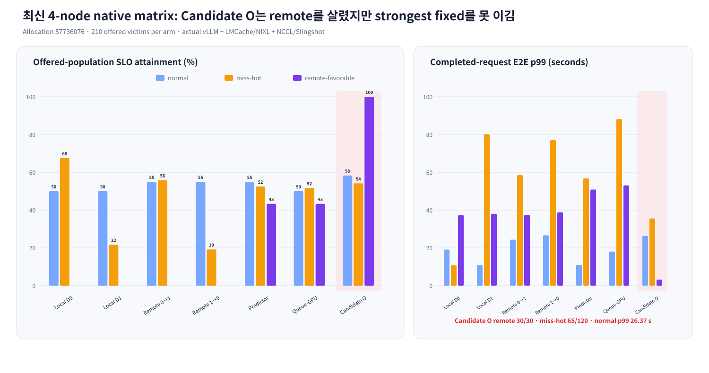
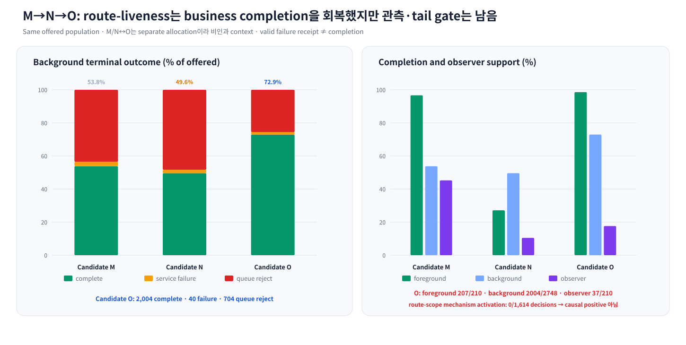
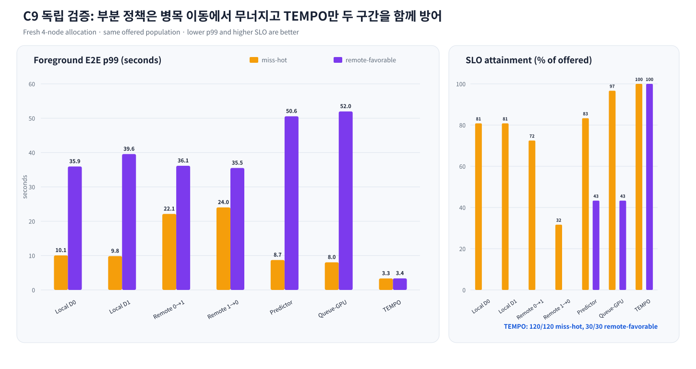
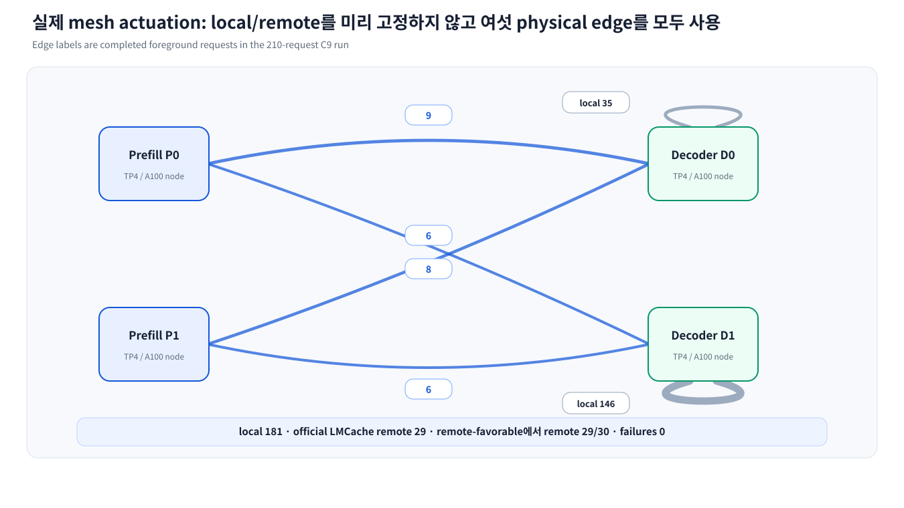
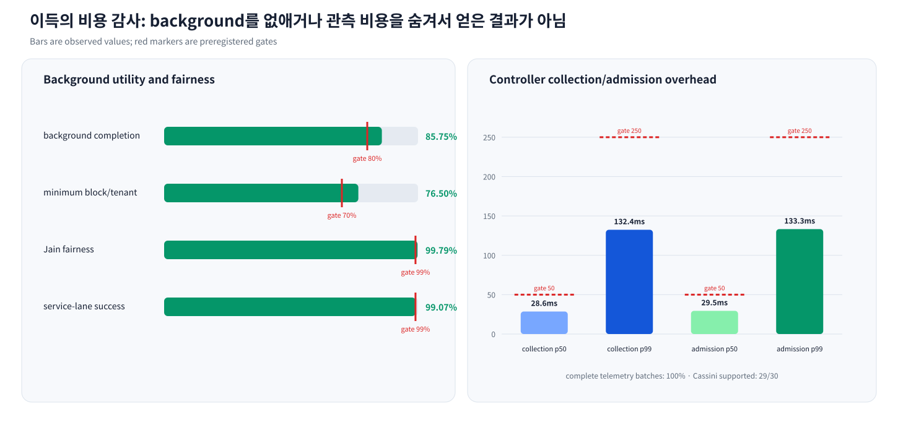
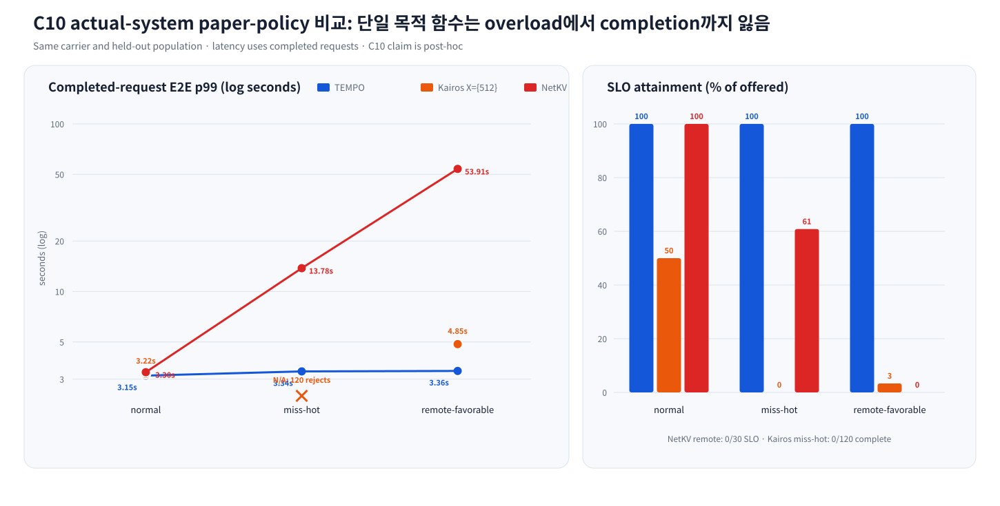
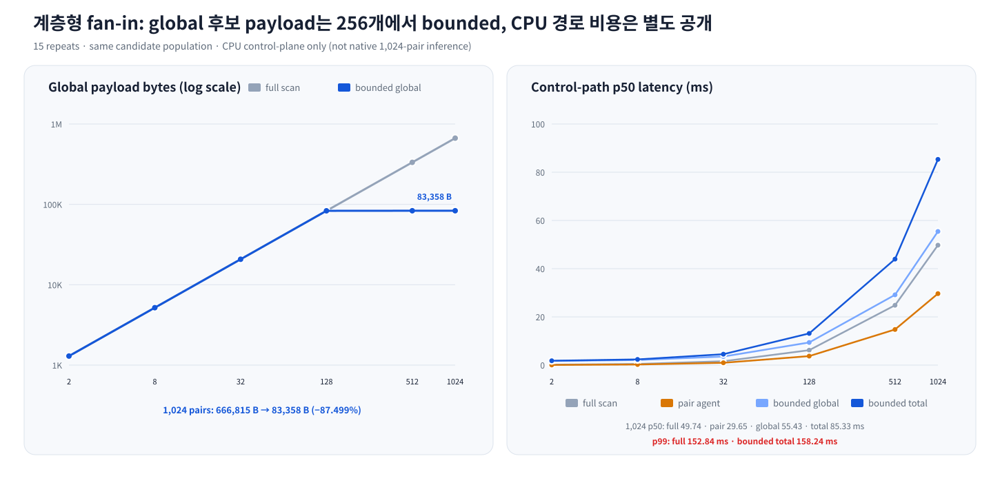

# TEMPO-GO 논문·평가 Artifact

이 디렉터리는 TEMPO-GO 논문 소스, 빌드된 PDF, README 정량 그래프와
machine-readable artifact manifest를 제공한다. 연구 동기, 설계, 7-arm 결과,
관련 연구와 전체 실행 역사는 저장소의 [루트 README](../../README.md)와
[통합 연구 상태 문서](../TEMPO_GO_UNIFIED_GOAL_STATE_AND_EXECUTION_PLAN.ko.md)에
정리되어 있다.

> 상태 주의: 아래의 C9/C10 headline 표·그래프·PDF는 이전 campaign의
> historical artifact다. 현재 source-of-truth는 통합 연구 상태 문서의
> §74.49--§74.58이다. C8 v48은 native discovery positive이지만 아직
> independent validation이 아니며, current-source C9 v19와 Candidate L v11은
> 각각 receiver hard-guard와 protected-reserve semantics의 negative discovery다.
> v10 dual-route business-lane은 별도의 strong discovery evidence지만 아직
> independent validation이 아니다. 따라서 아래
> historical 수치를 현재 독립 성능 주장으로 사용하지 않는다.

## Claim status

| 평가 | 상태 | 해석 범위 |
|---|---|---|
| C8 v48 native discovery | **positive, not independent** | current discovery evidence |
| C8 held-out validation | **OPEN** | fresh allocation required |
| C9 current-source causal burst v19 | **complete discovery, no claim** | native LMCache/NIXL overload와 guard actuation은 재현됐지만 대체 경로로 stressed tail 악화 |
| Candidate L v11 seven-arm native | **complete discovery, negative gate** | realistic overload는 재현됐지만 hot-local admission reject와 SLO trade-off로 최종 gate 실패 |
| v13 dual-route business-lane seven-arm | **complete discovery, negative gate** | allocation `57730228`; native transport/correctness/same-population은 통과했지만 observer coverage·strongest-fixed/SLO·normal-regression gate 실패 |
| Candidate M pressure-triggered pair spill | **complete discovery, negative gate** | allocation `57732862`; native transport/correctness/same-population은 통과했지만 miss-hot SLO/tail, observer coverage와 normal regression gate 실패 |
| Candidate N receiver-price frontier | **complete native arms, negative gate** | allocation `57732862`; all seven arms terminal, post-hoc analyzer complete, remote-favorable victim 0/30 completed |
| Candidate O route-liveness | **complete discovery, current negative gate** | allocation `57736076`; canonical seven-arm receipt complete, changed quarantine 0회 발동, strongest-fixed·observer gate 실패 |
| C10 NetKV/Kairos-X512 | **actual-system post-hoc positive** | independent SOTA claim 아님 |
| Kairos | **`X={512}` subset** | full dynamic-chunk implementation 아님 |
| 2–1,024 pair hierarchy | **CPU control-plane receipt** | native scale/goodput claim 아님 |

## 최신 Candidate O same-population 결과

Candidate O는 Candidate M의 joint business/fabric/mesh control을 유지하되,
telemetry-derived failure quarantine만 pair scope에서 route scope로 좁혔다. 새
4-node/16-A100 `gpu_interactive` allocation `57736076`에서 7-arm을 한 번에
완주했다.

| Policy | normal SLO / p99 | miss-hot SLO / p99 | remote-favorable SLO / p99 |
|---|---:|---:|---:|
| fixed local d0 | 30/60 / 19.123 s | 81/120 / 10.846 s | 0/30 / 37.378 s |
| fixed local d1 | 30/60 / 10.862 s | 26/120 / 80.159 s | 0/30 / 38.054 s |
| fixed remote p0→d1 | 33/60 / 24.343 s | 67/120 / 58.521 s | 0/30 / 37.430 s |
| fixed remote p1→d0 | 33/60 / 26.688 s | 23/120 / 77.033 s | 0/30 / 38.848 s |
| predictor | 33/60 / 11.035 s | 63/120 / 56.804 s | 13/30 / 50.888 s |
| queue-GPU | 30/60 / 18.073 s | 62/120 / 88.184 s | 13/30 / 53.074 s |
| **Candidate O** | **35/60 / 26.365 s** | **65/120 / 35.578 s** | **30/30 / 3.170 s** |

O는 predictor 대비 두 stressed regime의 p99를 37.37%/93.77% 줄였지만,
strongest fixed 대비 miss-hot p99는 228.03% 길고 SLO도 65/120 대 81/120이다.
normal p99는 best fixed보다 142.73% 길다. remote path가 실제로 사용됐다는 것은
확인됐지만, O가 바꾼 telemetry route-failure counter는 1,614개 global decision에서
모두 0이었고 `route_failure_quarantine` reject도 0건이었다. 따라서 O↔M 차이를
route-scope mechanism의 효과로 귀속할 수 없으며 O bundle의 negative receipt로만
기록한다.

terminal-semantics v2 집계에서 O의 foreground는 207 complete/3 service-lane
failure, background는 2,004 complete/40 failure/704 queue reject다. 기존 native
analysis의 `correctness=true`는 terminal receipt integrity를 뜻했으며 요청 성공을
뜻하지 않았다. v2는 `HTTP 200 + done + exact output tokens`만 completion으로 세고,
원본 raw/native analysis/completed receipt는 변경하지 않는다. observer support는
37/210(17.62%)이다.

Candidate-specific diagnosis는
`../../results/tempo_go_c9_route_liveness_job_57736076_r3_canonical_outer/candidate_o_diagnosis.json`
에 있다. M/N과 O는 allocation이 다르고 arm당 1회뿐이므로 business completion
차이는 비인과 context다. 직접 확인된 다음 병목은 co-load와 같은 lifetime에 묶인
observer publisher가 NIXL timeout과 함께 사라져 뒤 5개 block이 stale fallback으로
가는 구조, 그리고 global admission과 endpoint service-lane capacity가 하나의
lease로 예약되지 않는 구조다.

`../../results/tempo_go_c9_candidate_p_bounded_observer_v1/`은 이 observer-lifetime
confound만 분리하는 preregistered diagnostic이다. allocation `57740736`에서
7개 arm과 두 개의 8-rank cojob은 terminal receipt를 남겼고 마지막 observer도
존재했지만, global decision support는 102/210 (48.57%)였다. 따라서 cojob timeout과
observer process lifetime의 결합은 일부 분리했으나, P는 O policy delta가 없고
성능 evidence나 인과 검증이 아니며 durable observer sidecar와 atomic service
lease의 대체물이 아니다.

P의 fail-closed business accounting은 foreground 210/210 complete, background
1,898/2,748 complete, 145 failure, 705 global reject다. 최종 pair observer는
NCCL p99 36.82/36.87 ms와 LMCache transfer p99 5.94/6.09 s를 기록했다. compact
analysis와 completion receipt는 current evidence manifest의 SHA-256 binding으로
추적한다.

## Historical C9/C10 핵심 결과

| Policy | normal SLO / p99 | miss-hot SLO / p99 | remote-favorable SLO / p99 |
|---|---:|---:|---:|
| **TEMPO** | **60/60 / 3.150s** | **120/120 / 3.337s** | **30/30 / 3.357s** |
| strongest fixed | 60/60 / 3.156s | 97/120 / 9.849s | 0/30 / 35.508s |
| predictor | 60/60 / 3.104s | 100/120 / 8.709s | 13/30 / 50.557s |
| queue-GPU | 60/60 / 3.088s | 116/120 / 8.036s | 13/30 / 51.973s |
| Kairos `X={512}` | 30/60 / 3.223s | 0/120 / undefined | 1/30 / 4.853s |
| NetKV reproduction | 60/60 / 3.300s | 73/120 / 13.780s | 0/30 / 53.914s |

TEMPO의 stressed p99 감소율은 strongest fixed 대비 66.12–90.55%, predictor
대비 61.69–93.36%, queue-GPU 대비 58.48–93.54%다. C10 NetKV 대비
miss-hot/remote-favorable p99은 75.79%/93.77% 낮다.

## 최신 C8 v48 native discovery (independent 아님)

위 historical 표와 별도로, 현재 source-bound C8 v48 discovery의 동일 210-victim
population 결과는 다음과 같다. 이 표는 새 allocation independent validation이
끝나기 전까지 paper headline으로 승격하지 않는다.

| Policy | SLO-good | E2E p50 | E2E p99 |
|---|---:|---:|---:|
| fixed local d0 | 157/210 | 3046.3 ms | 33348.7 ms |
| fixed local d1 | 157/210 | 3176.6 ms | 32722.0 ms |
| fixed remote p0→d1 | 144/210 | 3469.8 ms | 31907.8 ms |
| fixed remote p1→d0 | 101/210 | 8569.3 ms | 31706.3 ms |
| predictor | 182/210 | 2963.7 ms | 50169.6 ms |
| queue-GPU | 184/210 | 3028.8 ms | 50483.1 ms |
| **TEMPO full** | **210/210** | **2996.7 ms** | **3243.1 ms** |

이 discovery의 p-only dual-decoder-hot block에서 TEMPO는 30/30 SLO-good,
`3043.8/3617.1 ms`였고 predictor는 13/30,
`40550.2/51067.4 ms`였다. 그러나 이 결과는 discovery allocation
`57700216`에 묶여 있으므로 독립 검증 전에는 성능 claim으로 사용하지 않는다.

## 정량 그래프

### 최신 Candidate O same-population native matrix



### Candidate M→N→O business/observer progression



### C9 independent seven-arm evaluation



### C9 P×D mesh actuation



### Background fairness와 controller overhead



### Actual NetKV/Kairos paper-policy extension



### 2–1,024 logical-pair hierarchy receipt



그래프는 [`render_readme_figures.py`](render_readme_figures.py)가 committed JSON을
읽어 생성한다. 숫자를 plotting source에 다시 입력하지 않는다.

```bash
.vllm_venv/bin/python paper/tempo_go/render_readme_figures.py
jq . paper/tempo_go/figures/manifest.json
```

[`figures/manifest.json`](figures/manifest.json)은 source JSON 17개와 SVG 7개의
SHA-256을 고정한다.

## Background와 telemetry gate

| 지표 | 관측값 | gate |
|---|---:|---:|
| background completion | 85.755% | ≥80% |
| minimum block/tenant completion | 76.496% | ≥70% |
| Jain fairness | 0.997873 | ≥0.99 |
| service-lane failure | 0.926% | ≤1% |
| telemetry collection p50/p99 | 28.62 / 132.42 ms | ≤50 / 250 ms |
| admission wait p50/p99 | 29.46 / 133.26 ms | ≤50 / 250 ms |

Cassini required endpoint signal은 29/30 decision, LMCache semantic/byte inflight는
30/30 decision에서 supported였다. `nccl_collective_p99_ms`,
`nccl_arrival_spread_ms`, `lmcache_transfer_p99_ms`는 explicit unsupported이며
0으로 대체하지 않았다.

## Paper

- [`main.tex`](main.tex): 2-column systems paper source
- [`references.bib`](references.bib): primary-source bibliography
- [`main.pdf`](main.pdf): compiled seven-page paper
- [`artifact_manifest.json`](artifact_manifest.json): headline claim과 SHA index
- [`current_evidence_manifest.json`](current_evidence_manifest.json): 최신 M/N/O raw-terminal-corrected evidence와 next gate SHA index

빌드:

```bash
cd paper/tempo_go
module load texlive/2024
pdflatex -halt-on-error -interaction=nonstopmode main.tex
bibtex main
pdflatex -halt-on-error -interaction=nonstopmode main.tex
pdflatex -halt-on-error -interaction=nonstopmode main.tex
```

현재 PDF SHA-256은
`3e35c65a92230ceef4576bff1ac5aa7ed42a33b82d76ab57a2d5cb2e3877f60f`다.
최종 build는 LaTeX error, unresolved citation/reference, overfull box 0으로
통과했다.

## Authoritative evidence

| 범위 | contract/analysis |
|---|---|
| C9 v10 partial discovery | `results/tempo_go_c9_causal_burst_current_source_v10.json` / `results/tempo_go_c9_causal_burst_job_57700216_current_source_v10/execution_failure_receipt.json` |
| C9 independent | `eval/sota_4node/tempo_go_c8_independent_validation_contract_v3.json` / `results/tempo_go_c8_independent_validation_job_57586612_v3/analysis.json` |
| C10 paper policy | `eval/sota_4node/tempo_go_c10_paper_sota_analysis_contract_v4.json` / `results/tempo_go_c10_paper_sota_job_57586612_v3/analysis.json` |
| hierarchy scale | `eval/sota_4node/tempo_go_hierarchy_scale_contract_20260825.json` / `results/tempo_go_hierarchy_scale_20260825_c9_c10_r15.json` |

Git artifact에는 aggregate result와 compact analysis를 포함한다. 전체 raw request/log
tree는 Perlmutter에 보존하며, compact analysis가 raw path와 SHA를 고정한다.

## Verification

- C9/current regression: 294 passed, 2 historical source-drift checks deselected,
  28 subtests passed
- C10 process-entry regression: 6 passed
- telemetry/endpoint regression: 93 passed
- bounded runtime import closure: 91 files `py_compile` passed
- canonical shell launchers: `bash -n` passed
- C9 frozen source inventory: 39/39 SHA match
- C9 v11 current-source inventory: 5/5 SHA match; bounded quiescence polling과
  receipted route-failure accounting 포함
- C10 v3→v4: performance source는 유지하고 analyzer만 명시적 analysis-only
  successor로 변경

## 남은 hard gate

1. 새 allocation에서 C10 source-unchanged repeat
2. full Kairos dynamic chunk candidate set 구현 또는 subset 표기 유지
3. NCCL/LMCache latency signal을 supported로 만든 causal ablation
4. 4노드보다 큰 native inference scale

이 gate 전에는 full Kairos 독립 우위, production-scale superiority, universal SOTA를
주장하지 않는다.

## 최신 버그·실험 영수증

재현·수정의 기준은 통합 문서 §74.33–§74.34와 다음 artifact다.

- C9 v10 partial root:
  `results/tempo_go_c9_causal_burst_job_57700216_current_source_v10/`
- C9 v10 contract SHA:
  `f3f3193b70d8d6f51e0fcf9d7014fb1a219b5362b79997611c45139177ffec55`
- C9 v11 corrected contract SHA:
  `436eca3690909752b48d69b0b351e17114b4979028840e86bade42599d2d23cb`
- v10에서 실제 확인된 failure: official LMCache/NIXL `batched_write` 60초
  timeout, UCX `mem type unpack` I/O error, 8-rank native co-job
- v10에서 별도로 확인된 harness failure: one-shot `nvidia-smi` quiescence
  check가 drain 중인 process를 보고 `set -e`로 campaign을 조기 종료
- 수정 원칙: 최대 120초 bounded polling, explicit receipt, fail-closed;
  root/UDI/privileged network 설정과 unknown process kill은 금지

### 최신 C9 v19 bug-fix 및 결과 receipt

통합 계획 §74.34가 최신 authoritative record다.

| 항목 | 기록 | 판정 |
|---|---|---|
| v15 native launch | NIXL rank4 `Address already in use` | setup-only, 성능 집계 제외 |
| v19 native campaign | allocation `57704230`, r7에서 4 arms complete | discovery negative |
| native overload | LMCache transfer p99 약 6–39 s, NCCL p99 최대 약 38.7 ms | 문제 실존 |
| v19 guard actuation | full arm별 `cross_layer_remote_receiver_hot` 62회 | guard 작동 |
| full C9 stressed gate | miss-hot SLO 0.1583 vs blind 0.9833, p99 26.528 s vs 6.089 s | 현재 policy 실패 |
| controller/contract regression | 124 passed, shell syntax 통과 | source/logic 검증 |

재현 경로:

- v19 결과: `../../results/tempo_go_c9_causal_burst_job_57704230_current_source_v19_r7/`
- current source-bound 계약: `../../results/tempo_go_c9_causal_burst_current_source_v19.json`
- 버그·수정·v0~v600 결과 분류: [`../TEMPO_GO_UNIFIED_GOAL_STATE_AND_EXECUTION_PLAN.ko.md`](../TEMPO_GO_UNIFIED_GOAL_STATE_AND_EXECUTION_PLAN.ko.md) §74.33–§74.34

v19는 route actuation과 hard guard가 실제로 발생했음에도 대체 receiver의 budget을
공동 예약하지 못해 피해자를 다른 경로로 이동시켰다. 따라서 다음 구현 대상은
계수 재조정이 아니라 pair별 receiver budget, source/edge/receiver 공동 admission,
hot-pair quarantine, bounded fallback/reject, pair1 telemetry coverage다.

### Current continuation receipt

Candidate L v11의 raw를 다시 분해하면 `combined_hot_d0/d1`에서 TEMPO가
`decoder_local_chunked_prefill`에 머물며 global queue timeout을 각각 372/374건
냈다. 반면 v10 dual-route arm은 같은 계열 block에서 official remote route를
92/95건 사용했다. 이 차이를 반영한 다음 실행 계약은
`../../results/tempo_go_c9_dual_route_business_lane_v13/`에 있다. 계약은
fixed local/remote 4개, predictor, queue-GPU, dual-route TEMPO를 동일 native
NCCL + official LMCache/NIXL receiver-incast workload로 비교한다.

v13 native discovery는 allocation `57730228`에서 7개 arm의 terminal receipt와
offered-population 분석을 생성해 닫혔다. 이 결과는 fresh independent validation이
아니므로 기존 v10 수치를 논문 최종 headline로 승격하지 않는다. 7-arm one-shot에는 최소 150분의 4-node
`gpu_interactive` outer step이 필요하다. fresh allocation에서 모든 arm의 terminal
receipt와 offered-population 분석이 생성되기 전에는 기존 v10 수치를 논문 최종
headline로 승격하지 않는다. v13 population contract SHA는
`989a09e0f005967ec5f1ff1ec17b9244b5dee0b5e39f04d0b479a8e5c1de8a69`이고, 실행은
v13 contract SHA를 고정하는
`eval/sota_4node/run_tempo_go_c9_dual_route_business_lane_v13_in_allocation.sh`
wrapper를 통해서만 허용한다. 관련 source-bound 회귀검사는 `154 passed`다.

### v13 native discovery receipt

`../../results/tempo_go_c9_causal_burst_job_57730228/analysis.json`의 동일
210-victim 결과는 다음과 같다.

| Policy | p50 | p99 | offered SLO |
|---|---:|---:|---:|
| fixed local d0 | 7.943 s | 32.985 s | 50.5% |
| fixed local d1 | 8.924 s | 55.916 s | 46.2% |
| fixed remote p0→d1 | 8.505 s | 50.272 s | 47.1% |
| fixed remote p1→d0 | 16.902 s | 76.272 s | 27.6% |
| predictor | 5.479 s | 50.454 s | 60.5% |
| queue-GPU | 7.721 s | 54.299 s | 55.7% |
| **TEMPO v13** | **9.972 s** | **23.917 s** | **32.9%** |

모든 arm은 210/210 victim을 완료했지만 TEMPO의 observer-supported decision은
98/210(46.7%)이었다. remote-favorable block에서는 TEMPO가 30/30 SLO-good,
p99 3.214초를 냈지만 miss-hot에서는 SLO 6.7%로 strongest fixed와 predictor보다
낮았다. 따라서 realistic contention은 확인됐고 현재 후보의 policy gate는
실패했으며, `performance_claim_allowed=false`다. 다음 target은 route score가
아니라 service-lane feasibility와 observer coverage다.

### M 실행 전 회귀 검증

Candidate M native 실행 전 current source-bound C8 contract가 일부 소스의
과거 SHA를 가리키던 stale-contract 오류를 수정했다. 과거 결과는 변경하지 않고
현재 contract만 갱신했으며, 관련 회귀 묶음은 `133 passed`, M population source
inventory는 7/7 일치, wrapper syntax는 통과했다. 이는 성능 결과가 아니다.

새 allocation `57732862`에서 M 7-arm one-shot이 완료됐고, 모든 arm의 terminal
receipt와 analyzer가 생성됐다. 기존 `57730228`과 결과를 섞거나 덮어쓰지 않았다.

추가로 C9 current contract의 세 source SHA와 과거 단일-pair NIXL port assertion을
현재 runner에 맞게 갱신했다. historical contract/result는 변경하지 않았으며,
C9 current·C10 baseline·M preflight 회귀는 `9 passed`다. 이는 native 성능 결과가
아니라 다음 interactive 실행 전 source-bound correctness closure다.

### Candidate M native discovery receipt (`57732862`)

새 4-node/16-A100 `gpu_interactive` allocation에서 실제 vLLM P/D, official
LMCache/NIXL-UCX와 NCCL/Slingshot co-job을 함께 실행했다. M은 v13과 동일한
210-victim/2,748-background offered population을 사용했으며, co-job timeout은
setup failure가 아니라 observer correctness 이후의 overload outcome으로
보존됐다.

| Policy | normal SLO / p99 | miss-hot SLO / p99 | remote-favorable SLO / p99 |
|---|---:|---:|---:|
| fixed local d0 | 34/60 / 20.375 s | 82/120 / 10.693 s | 0/30 / 38.244 s |
| fixed local d1 | 30/60 / 13.871 s | 17/120 / 65.437 s | 0/30 / 38.070 s |
| fixed remote p0→d1 | 38/60 / 25.560 s | 30/120 / 49.741 s | 0/30 / 37.500 s |
| fixed remote p1→d0 | 35/60 / 23.692 s | 20/120 / 99.120 s | 0/30 / 37.219 s |
| predictor | 36/60 / 29.621 s | 94/120 / 39.308 s | 13/30 / 50.989 s |
| queue-GPU | 30/60 / 31.059 s | 104/120 / 71.638 s | 10/30 / 53.967 s |
| **Candidate M** | **30/60 / 10.246 s** | **30/120 / 31.785 s** | **30/30 / 3.195 s** |

M의 remote-favorable route는 30/30 SLO-good으로 회복됐고 p99도 3.195초였다.
그러나 miss-hot은 strongest fixed인 local-d0의 82/120보다 낮은 30/120이고,
M 전체의 observer-supported decision은 95/210(45.24%)뿐이었다. fail-closed
HTTP-200 기준 background도 1,478/2,748(53.78%)만 완료되고 73건이 실패했으며
1,197건이 global reject됐다. 따라서
`same_population`, `native_transport`, `correctness`, `full_cross_layer_actuation`
은 true지만 `full_observer_supported`, stressed p99/SLO non-regression과
normal p50 regression gate는 false이며 `performance_claim_allowed=false`다.

정확한 machine-readable 결과는
`../../results/tempo_go_c9_causal_burst_job_57732862/analysis.json`이다. 이 결과는
“remote를 쓰면 해결된다”가 아니라, 관측된 pair pressure로 packed pair spill을
허용하면 remote-favorable 구간은 살릴 수 있지만 local/remote/fabric pressure와
background fairness를 하나의 budget으로 관리하지 않으면 miss-hot 피해와
background rejection을 만든다는 결론이다. 다음 구현은 더 많은 threshold 후보가
아니라 service-lane feasibility, transfer concurrency, decoder admission/fairness,
observer coverage와 pair scaling을 함께 결정하는 global policy여야 한다.

### Candidate N native global-frontier receipt (`57732862`)

Candidate N은 M의 pressure spill에 pair-scoped
`cross_layer_local_receiver_price_ms=0.10`을 한 요소만 추가하고, 같은
210-victim/2,748-background population과 actual vLLM P/D,
LMCache/NIXL-UCX, NCCL/Slingshot co-job으로 7-arm을 다시 실행했다.

| Policy | normal SLO / p99 | miss-hot SLO / p99 | remote-favorable SLO / p99 |
|---|---:|---:|---:|
| fixed local d0 | 31/60 / 17.834 s | 92/120 / 9.774 s | 0/30 / 38.236 s |
| fixed local d1 | 30/60 / 20.959 s | 25/120 / 63.524 s | 0/30 / 37.577 s |
| fixed remote p0→d1 | 31/60 / 28.757 s | 78/120 / 18.395 s | 0/30 / 36.201 s |
| fixed remote p1→d0 | 33/60 / 32.433 s | 22/120 / 79.048 s | 0/30 / 38.932 s |
| predictor | 30/60 / 25.826 s | 75/120 / 58.197 s | 13/30 / 50.774 s |
| queue-GPU | 30/60 / 20.742 s | 98/120 / 41.015 s | 11/30 / 52.024 s |
| **Candidate N** | **0/60 / 31.344 s** | **0/120 / 18.187 s** | **0/30 / —** |

N은 local 54건, remote 3건만 route했고 remote-favorable victim은 한 건도
완료하지 못했다. observer-supported decision도 22/210(10.48%)이었다.
correctness/native transport/same population/cross-layer actuation은 true지만,
observer coverage, stressed p99/SLO와 normal regression gate는 모두 false다.
따라서 `performance_claim_allowed=false`이며 이 receiver-price factor는
기각한다.

최초 analyzer는 offered 30, completed 0인 regime의 null p50/p99를 finite
metric으로 요구해 campaign 후처리를 중단했다. raw/GPU artifact는 바꾸지 않고
analyzer가 빈 completed population을 null로 보존하고 관련 gate를 fail-closed하도록
수정했다. 회귀 묶음은 `102 passed`다. 일곱 native arm은 모두 terminal이지만
초기 analyzer 중단 때문에 top-level `completed_attempt.json`은 없으며, 현재
`../../results/tempo_go_c9_global_frontier_job_57732862/analysis.json`은 명시적인
post-hoc reanalysis다.

이 결과 뒤의 다음 target은 scalar route price가 아니다. atomic observer
coverage, decoder admission/fairness, pair scaling, transfer concurrency와
foreground/background utility를 하나의 global frontier로 구현한 뒤 같은
offered population으로 1/2/4-node 및 2–3개 SOTA policy를 비교해야 한다. 상세
artifact SHA와 실행 순서는 통합 계획 §74.58을 따른다.
